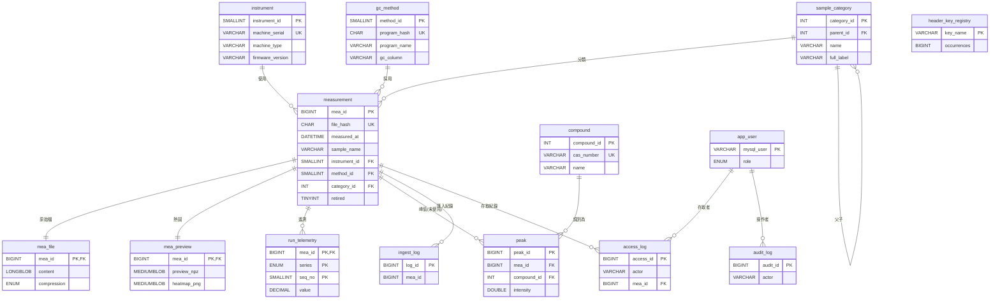
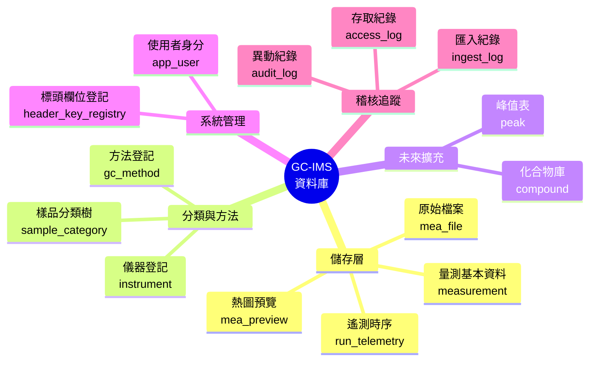
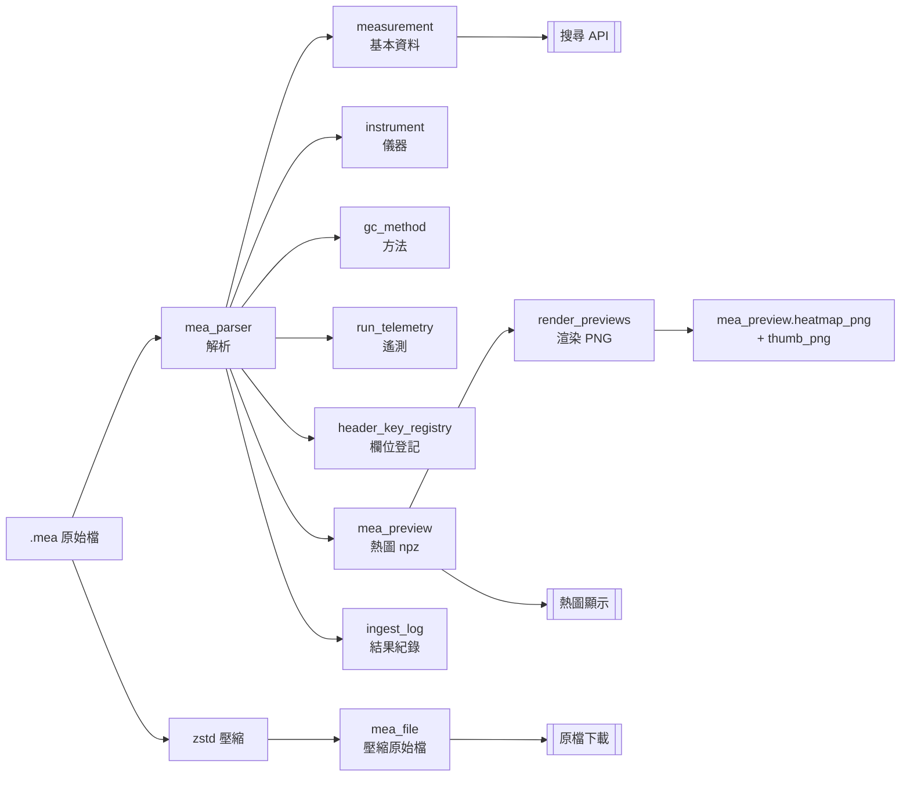

<!-- Version 1.0 -->
# GC-IMS 量測資料庫系統 專案報告

**版本**：1.0（首次正式發布）
**撰寫日期**：2026 年 9 月 8 日
**適用對象**：管理階層、部門主管與非資訊背景之工程師
**專案性質**：實驗室資料管理系統

---

## 目錄

1. [專案概述](#一專案概述)
2. [專案目的與目標](#二專案目的與目標)
3. [系統詳細說明](#三系統詳細說明)
4. [資料庫架構總覽](#四資料庫架構總覽)
5. [資料表詳細說明](#五資料表詳細說明)
6. [資料庫階層結構圖](#六資料庫階層結構圖)
7. [Python 程式檔案說明](#七python-程式檔案說明)
8. [測試程式檔案說明](#八測試程式檔案說明)
9. [資料品質保證機制](#九資料品質保證機制)
10. [效能與規模數據](#十效能與規模數據)
11. [系統願景與公司效益](#十一系統願景與公司效益)
12. [未來發展方向](#十二未來發展方向)

---

## 一、專案概述

本專案是為 G.A.S. FlavourSpec 氣相層析離子遷移光譜儀（GC-IMS）所產生的 `.mea`
量測檔案，打造的**集中式資料庫系統**。原本散落在各實驗室個人電腦、隨身碟、
NAS 資料夾中的量測資料，將全數收納在單一 MySQL 資料庫內，並提供：

- **搜尋**：可依樣品名稱、日期、儀器、方法、樣品類別等條件快速找出過往資料
- **快速瀏覽**：一鍵展示每筆量測的熱圖（heatmap），無需開啟原始檔案
- **資料完整性保證**：儲存原始 `.mea` 檔案（壓縮儲存），確保任何時候都能還原原始資料
- **多帳號協作**：不同角色（管理員、標註員、檢視者）依權限存取，全程紀錄

### 版本 1.0 已完成的關鍵成果

| 項目 | 數量 |
|---|---|
| 已載入的實際量測檔案 | 49 筆 |
| 原始檔案總量 | 3.32 GB |
| 壓縮後儲存量 | 0.93 GB（壓縮比 3.56 倍） |
| 支援的儀器韌體版本 | 5 個世代（2.16 / 2.29 / 2.52 / 4.73 / 4.82） |
| 支援的儀器型號系列 | 2 種（FlavourSpec 雙 EPC、GC-IMS 泵浦式） |
| 資料表數量 | 14 張 |
| 自動化測試案例 | 190 條全部通過 |

---

## 二、專案目的與目標

### 2.1 為何要建置這個系統

在專案開始之前，公司內的 GC-IMS 量測資料面臨以下問題：

1. **檔案散落各地**：資料檔案可能存放在儀器主機、實驗人員個人電腦、NAS、外接硬碟中，
   難以掌握完整館藏；離職人員的資料可能因換機而遺失。
2. **搜尋困難**：想找「2024 年做過的茶葉樣品」需要靠人力翻找資料夾，耗時且容易遺漏。
3. **無法快速預覽**：每次要看熱圖都得開啟原始檔案（每檔 40–150 MB），開啟時間 1–3 秒，
   若要批次比較多個樣品極為費時。
4. **資料格式隨儀器韌體變異**：不同世代的 `.mea` 檔案標頭欄位名稱不一致，
   自製工具容易在新機器上壞掉。
5. **無異動追蹤**：實驗紀錄的描述、註記、分類若有修改，沒有留下歷史紀錄。

### 2.2 專案目標

| 目標 | 具體指標 |
|---|---|
| **集中儲存** | 所有 `.mea` 檔案（原始位元組級精確保存）進入單一 MySQL 資料庫 |
| **可搜尋** | 樣品名稱、日期、儀器、方法、類別、標頭欄位皆可查詢 |
| **快速瀏覽** | 熱圖預覽 < 100 毫秒（比原始檔案快 50 倍以上） |
| **資料完整性** | SHA-256 雜湊碼驗證，確保取出時位元組完全一致 |
| **格式相容性** | 支援 5 個以上韌體世代，新韌體出現時可平滑擴充 |
| **權限分離** | 管理員可改寫、標註員可註記、檢視者僅讀取 |
| **異動可追溯** | 所有寫入操作留下 actor、時間、原值、新值 |

### 2.3 專案範疇與界線

本專案**只做**「量測資料的集中儲存與檢索」，明確**不做**下列事項：

- 峰值偵測（peak detection）：屬於外部分析工具的職責
- 化合物比對（compound matching）：同上
- 資料品質判斷（如「這筆資料合不合格」）：由分析人員自行判斷

上述功能由公司內既有的 [GC-IMS-PEAK](https://github.com/shengic/GC-IMS-PEAK)
分析工具負責，該工具會從本資料庫**讀取**原始檔案或熱圖，
自行執行分析，將結果保留在其自己的世界中。

未來若分析工具產出可信的化合物識別結果，本資料庫已預留了 `peak` 與 `compound`
兩張空的資料表，可以在不遷移資料的情況下，直接把識別結果回寫回來，
讓「哪些樣品裡有某某化合物」這樣的黃金查詢成為可能。

---

## 三、系統詳細說明

### 3.1 系統元件全貌

```
┌──────────────────────────────────────────────────────────────────┐
│                     GC-IMS 量測資料庫系統                       │
├──────────────────────────────────────────────────────────────────┤
│                                                                  │
│  【儲存核心】MySQL 8 資料庫（gc-ims_database）                   │
│      ├─ 14 張資料表                                              │
│      ├─ 1 個預存程序（move_category）                            │
│      ├─ 2 個觸發器（防止分類自我循環）                           │
│      └─ 4 個檢查限制（防止不合法資料）                           │
│                                                                  │
│  【資料匯入】Python 匯入管線（scripts/）                         │
│      ├─ mea_parser.py    ── 解析 .mea 檔案                       │
│      ├─ mea_preview.py   ── 產生熱圖預覽                         │
│      ├─ ingest_mea.py    ── 批次匯入主程式                       │
│      ├─ render_previews.py ── 熱圖 PNG 產生器                    │
│      └─ apply_schema.py  ── 資料庫建置工具                       │
│                                                                  │
│  【品質保證】Python 測試套件（tests/）                           │
│      ├─ 27 個資料完整性掃描                                      │
│      ├─ 163 個功能與規則測試                                     │
│      └─ 全部 190 條測試通過                                      │
│                                                                  │
│  【存取應用】（下一階段開發）                                    │
│      ├─ 管理員 App（Tkinter 桌面應用）                           │
│      ├─ 檢視者 App（Tkinter 桌面應用）                           │
│      └─ 未來可延伸為網頁介面                                     │
│                                                                  │
└──────────────────────────────────────────────────────────────────┘
```

### 3.2 資料處理流程

一份 `.mea` 檔案從進入系統到可供查詢的完整流程：

```
[原始 .mea 檔案（40–150 MB）]
        │
        ▼
【第 1 步：讀入與雜湊】
    產生 SHA-256 雜湊碼，用於判斷是否為重複檔案
        │
        ▼
【第 2 步：切割檔案】
    區分文字標頭區（60 種左右的 key = value）
    與二進位矩陣區（int16 資料點）
        │
        ▼
【第 3 步：解析標頭】
    抽取儀器、方法、時間、樣品名等資訊
    對未知的欄位不強制解析，全數保存到 JSON
        │
        ▼
【第 4 步：定位 RIP 反應離子峰】
    使用 VOCal 相容演算法，掃描漂移軸前 200 點以後的區間
        │
        ▼
【第 5 步：儲存主要資料】
    儀器 → instrument 表
    方法 → gc_method 表
    量測基本資料 → measurement 表
    運行遙測數據 → run_telemetry 表
        │
        ▼
【第 6 步：降取樣預覽】
    對原始 8571×4500 的矩陣做 max-pool 降取樣至約 714×750
    以 numpy npz 格式壓縮儲存到 mea_preview 表
        │
        ▼
【第 7 步：壓縮原始檔案】
    使用 zstd 壓縮率約 3.5–4 倍
    儲存到 mea_file 表
        │
        ▼
【第 8 步：紀錄匯入結果】
    在 ingest_log 表寫入成功/失敗/警告訊息
        │
        ▼
【第 9 步（獨立步驟）：產生熱圖 PNG】
    由 render_previews.py 讀取 mea_preview 的 npz
    以 matplotlib 產生帶座標軸的熱圖圖片
    刻意與匯入分離，方便日後更換調色盤或重新產生
```

### 3.3 核心設計理念

以下三個原則貫穿整個系統設計：

1. **資料庫是唯一真相來源**：`.mea` 原始檔案的**位元組副本**必須存在資料庫內，
   即使檔案系統壞掉、NAS 斷線，資料庫本身仍可完整還原每一筆量測。
2. **未知不當錯誤，只當警告**：新版韌體可能加入前所未見的欄位，
   系統絕不因此拒絕匯入；未知欄位全部收進 JSON 欄位並登記，等日後決定是否要單獨處理。
3. **人工欄位與機器欄位分開**：儀器讀出的數值屬機器欄位，可隨時重新產生（例如
   換個演算法重跑）；使用者填寫的樣品描述、備註、分類屬人工欄位，
   匯入程式**絕不觸碰**，避免辛苦的人工註記被覆蓋。

---

## 四、資料庫架構總覽

### 4.1 基本規格

| 項目 | 內容 |
|---|---|
| 資料庫管理系統 | MySQL 8.0.42 |
| 字元集 | utf8mb4（完整支援繁體中文、日文、韓文、Emoji 等） |
| 資料庫名稱 | `gc-ims_database` |
| 資料表數量 | 14 張 |
| 預存程序 | 1 個（`move_category`：分類樹搬移） |
| 觸發器 | 2 個（防止分類自我循環） |
| 檢查限制 | 4 個（欄位級資料合理性檢查） |

### 4.2 資料表分類

14 張資料表依用途可分為 5 大類：

| 分類 | 資料表 | 用途 |
|---|---|---|
| **核心量測** | `measurement`, `mea_file`, `mea_preview`, `run_telemetry` | 每筆量測的基本資料、原始檔案、熱圖、遙測 |
| **共享字典** | `instrument`, `gc_method`, `sample_category` | 儀器登記、GC 方法登記、樣品分類樹 |
| **未來擴充**（暫空） | `peak`, `compound` | 保留給外部分析工具的識別結果回寫 |
| **系統管理** | `app_user`, `header_key_registry` | 使用者身分、標頭欄位登記表 |
| **稽核追蹤** | `ingest_log`, `access_log`, `audit_log` | 匯入紀錄、存取紀錄、異動紀錄 |

---

## 五、資料表詳細說明

以下依照重要程度說明各資料表用途，並列出每張表的欄位定義。

**欄位表格格式說明**：
- 「限制」欄標示 PK（主鍵）、FK（外部鍵）、UK（唯一鍵）、IDX（索引）、CHECK（檢查限制）
- 「可空」欄標示是否允許空值（NULL）

### 5.1 `measurement`（量測主表）

**用途**：每一筆量測（一個 `.mea` 檔案）對應一列，是整個系統的中心表格。
包含儀器、方法、時間、樣品名稱等搜尋條件，以及矩陣尺寸資訊。

**欄位清單（共 34 個欄位）**：

| # | 欄位名稱 | 資料型別 | 可空 | 限制 | 說明 |
|---|---|---|---|---|---|
| 1 | mea_id | BIGINT UNSIGNED | 否 | PK, 自動遞增 | 量測流水編號，永久不會變 |
| 2 | file_name | VARCHAR(255) | 否 | | 檔名（例如 `260826_123948_TEA_1.碧螺春_1.mea`） |
| 3 | file_hash | CHAR(64) | 否 | UK（uk_hash） | 檔案的 SHA-256 雜湊碼，用於防重複 |
| 4 | file_size_bytes | BIGINT UNSIGNED | 否 | | 原始檔案位元組數 |
| 5 | measured_at | DATETIME | 否 | IDX（idx_time_id） | 量測時間（來自檔案標頭 Timestamp） |
| 6 | instrument_id | SMALLINT UNSIGNED | 否 | FK → instrument | 儀器編號 |
| 7 | method_id | SMALLINT UNSIGNED | 否 | FK → gc_method, IDX | GC 方法編號 |
| 8 | sample_name | VARCHAR(255) | 否 | IDX（idx_sample） | 樣品名稱（來自檔案標頭 Sample） |
| 9 | sample_class | VARCHAR(64) | 是 | | 樣品類別（來自檔案標頭 Class） |
| 10 | sample_type | ENUM(5 種) | 否 | IDX（idx_type_time） | 樣品類型：sample/blank/standard/qc/unknown |
| 11 | status | VARCHAR(16) | 是 | | 狀態（valid/doubtful 等） |
| 12 | header_bytes | INT UNSIGNED | 否 | CHECK | 標頭區位元組數 |
| 13 | n_spectra | INT UNSIGNED | 否 | CHECK | 光譜列數（時間軸資料點數） |
| 14 | n_drift_points | INT UNSIGNED | 否 | CHECK | 漂移軸資料點數 |
| 15 | matrix_dtype | VARCHAR(8) | 否 | CHECK | 矩陣資料型別（目前僅 int16le） |
| 16 | chunk_averages | SMALLINT UNSIGNED | 是 | | 疊加次數 |
| 17 | sample_rate_khz | DECIMAL(7,2) | 是 | | 取樣頻率（kHz） |
| 18 | trig_repetition_ms | DECIMAL(7,3) | 是 | | 觸發重複時間（ms） |
| 19 | run_time_s | DECIMAL(8,1) | 是 | | 總運行時間（秒） |
| 20 | ambient_pressure_kpa | DECIMAL(7,3) | 是 | | 環境壓力（kPa） |
| 21 | polarity | ENUM('positive','negative') | 是 | | 訊號極性 |
| 22 | rip_drift_index | INT UNSIGNED | 是 | CHECK | RIP 位於漂移軸的索引位置 |
| 23 | rip_drift_ms | DECIMAL(8,4) | 是 | | RIP 對應的漂移時間（ms） |
| 24 | header_json | JSON | 否 | | 完整標頭全部欄位（保留所有原文） |
| 25 | created_at | TIMESTAMP | 是 | 預設值：現在時間 | 匯入時間 |
| 26 | full_path | VARCHAR(1024) | 是 | | 匯入來源檔案的完整路徑 |
| 27 | folder_name | VARCHAR(255) | 是 | IDX（idx_folder） | 父資料夾名稱（常帶批次語意） |
| 28 | description | VARCHAR(512) | 是 | | **人工欄位**：樣品描述 |
| 29 | note | TEXT | 是 | | **人工欄位**：備註 |
| 30 | category_id | INT UNSIGNED | 是 | FK → sample_category, IDX | **人工欄位**：分類 |
| 31 | retired | TINYINT(1) | 否 | IDX, CHECK, 預設 0 | 是否已軟刪除（1=退役） |
| 32 | retired_at | DATETIME | 是 | CHECK | 退役時間 |
| 33 | retired_by | VARCHAR(64) | 是 | CHECK | 退役操作者 |
| 34 | retired_reason | VARCHAR(255) | 是 | | 退役原因 |

### 5.2 `mea_file`（原始檔案儲存表）

**用途**：儲存 `.mea` 檔案的**壓縮原始位元組**。每筆量測一列，
利用 zstd 壓縮節省 3–4 倍空間。若檔案系統毀損，仍可從資料庫完整還原原檔。

| # | 欄位名稱 | 資料型別 | 可空 | 限制 | 說明 |
|---|---|---|---|---|---|
| 1 | mea_id | BIGINT UNSIGNED | 否 | PK, FK → measurement | 對應的量測編號 |
| 2 | compression | ENUM('none','zstd','gzip') | 否 | 預設 zstd | 壓縮演算法 |
| 3 | orig_size | BIGINT UNSIGNED | 否 | | 原始位元組數 |
| 4 | stored_size | BIGINT UNSIGNED | 否 | | 壓縮後位元組數 |
| 5 | content | LONGBLOB | 否 | | 壓縮後的檔案位元組 |
| 6 | stored_at | TIMESTAMP | 是 | 預設值：現在時間 | 儲存時間 |

### 5.3 `mea_preview`（熱圖預覽表）

**用途**：儲存每筆量測的**降取樣熱圖預覽**。透過 max-pool 演算法將原始
8571×4500 矩陣縮小至約 714×750，仍保留窄峰特徵；每次搜尋顯示熱圖時
只讀這張表，不必解壓 40–150 MB 的原檔。

| # | 欄位名稱 | 資料型別 | 可空 | 限制 | 說明 |
|---|---|---|---|---|---|
| 1 | mea_id | BIGINT UNSIGNED | 否 | PK, FK → measurement | 對應的量測編號 |
| 2 | preview_npz | MEDIUMBLOB | 否 | | 降取樣矩陣 + 座標軸（numpy npz 格式） |
| 3 | heatmap_png | MEDIUMBLOB | 是 | | 已渲染的熱圖 PNG（含座標軸與色階） |
| 4 | thumb_png | MEDIUMBLOB | 是 | | 縮圖 PNG（約 260 px 寬） |
| 5 | png_render_ver | SMALLINT UNSIGNED | 是 | | 渲染配方版本 |
| 6 | prev_rows | SMALLINT UNSIGNED | 否 | | 降取樣後列數 |
| 7 | prev_cols | SMALLINT UNSIGNED | 否 | | 降取樣後行數 |
| 8 | pool_rt | SMALLINT UNSIGNED | 否 | | 時間軸壓縮倍率 |
| 9 | pool_dt | SMALLINT UNSIGNED | 否 | | 漂移軸壓縮倍率 |
| 10 | pipeline_ver | SMALLINT UNSIGNED | 否 | 預設 1 | 處理流程版本 |

### 5.4 `instrument`（儀器登記表）

**用途**：登記每一台 GC-IMS 儀器的基本資訊，同一台儀器多次量測共用一筆紀錄。

| # | 欄位名稱 | 資料型別 | 可空 | 限制 | 說明 |
|---|---|---|---|---|---|
| 1 | instrument_id | SMALLINT UNSIGNED | 否 | PK, 自動遞增 | 儀器編號 |
| 2 | machine_type | VARCHAR(64) | 否 | | 型號（FlavourSpec® / GC-IMS） |
| 3 | machine_serial | VARCHAR(32) | 否 | UK（uk_serial） | 序號 |
| 4 | machine_name | VARCHAR(64) | 是 | | 名稱 |
| 5 | adio_serial | VARCHAR(32) | 是 | | ADIO 序號 |
| 6 | firmware_version | VARCHAR(16) | 是 | | 韌體版本 |
| 7 | firmware_date | DATE | 是 | | 韌體日期 |
| 8 | drift_tube_um | INT UNSIGNED | 是 | | 漂移管長度（μm） |
| 9 | drift_voltage_v | DECIMAL(7,1) | 是 | | 漂移電壓（V） |
| 10 | sensor_data | VARCHAR(128) | 是 | | 感測器資料（如放射源） |

### 5.5 `gc_method`（層析方法表）

**用途**：登記每一種 GC 分離方法，同一方法多次量測共用一筆。
若同名方法內容略有調整（如溫度、時間），會產生不同的 `program_hash` 進而分為兩列。

| # | 欄位名稱 | 資料型別 | 可空 | 限制 | 說明 |
|---|---|---|---|---|---|
| 1 | method_id | SMALLINT UNSIGNED | 否 | PK, 自動遞增 | 方法編號 |
| 2 | program_name | VARCHAR(64) | 是 | | 方法名稱（例如 TEA-C） |
| 3 | program_raw | TEXT | 是 | | 完整方法字串 |
| 4 | gc_column | VARCHAR(128) | 是 | | 層析管柱 |
| 5 | drift_gas | VARCHAR(32) | 是 | | 漂移氣體 |
| 6 | flow_ims_setpoint_ml_min | DECIMAL(6,1) | 是 | | IMS 流量設定（ml/min） |
| 7 | flow_gc_setpoint_ml_min | DECIMAL(6,1) | 是 | | GC 流量設定（ml/min） |
| 8 | temp_setpoints_c | JSON | 是 | | 溫度設定（T1–T6 的字典） |
| 9 | program_hash | CHAR(64) | 否 | UK（uk_program） | 方法內容的 SHA-256 |

### 5.6 `run_telemetry`（運行遙測表）

**用途**：儲存量測過程中的**時序遙測資料**，如流量、壓力隨時間變化。
一筆量測會產生數十至數百列。

| # | 欄位名稱 | 資料型別 | 可空 | 限制 | 說明 |
|---|---|---|---|---|---|
| 1 | mea_id | BIGINT UNSIGNED | 否 | PK 一部分, FK → measurement | 對應的量測編號 |
| 2 | series | ENUM(7 種) | 否 | PK 一部分 | 遙測類別（flow_ims / flow_gc / press_ims / press_gc / press_ambient / pump1_flow / pump1_pressure） |
| 3 | seq_no | SMALLINT UNSIGNED | 否 | PK 一部分 | 時序編號（0, 1, 2, ...） |
| 4 | value | DECIMAL(10,3) | 否 | | 數值 |

### 5.7 `sample_category`（樣品分類樹）

**用途**：以樹狀結構管理樣品分類（例如「酒類 → 威士忌 → 單一麥芽 → 山崎 12 年」），
每筆量測可歸屬於任一層節點。

| # | 欄位名稱 | 資料型別 | 可空 | 限制 | 說明 |
|---|---|---|---|---|---|
| 1 | category_id | INT UNSIGNED | 否 | PK, 自動遞增 | 分類編號 |
| 2 | parent_id | INT UNSIGNED | 是 | FK 自參考, IDX | 上層分類編號（NULL 表示根節點） |
| 3 | name | VARCHAR(128) | 否 | UK（同層唯一，uk_sibling） | 分類名稱 |
| 4 | full_label | VARCHAR(512) | 否 | | 完整路徑（例：`酒類 > 威士忌 > 山崎`） |
| 5 | depth | SMALLINT UNSIGNED | 否 | 預設 0 | 樹的深度 |
| 6 | sort_order | SMALLINT UNSIGNED | 否 | 預設 0 | 顯示排序 |

### 5.8 `header_key_registry`（標頭欄位登記表）

**用途**：累計登記所有量測檔案中曾出現過的**標頭欄位名稱**。
新的韌體出現新欄位時，此表會自動加入該欄位；系統管理員可從這裡看出「哪些欄位常出現、哪些少見」。

| # | 欄位名稱 | 資料型別 | 可空 | 限制 | 說明 |
|---|---|---|---|---|---|
| 1 | key_name | VARCHAR(128) | 否 | PK | 欄位名稱 |
| 2 | first_seen_at | TIMESTAMP | 是 | 預設值：現在時間 | 首次出現時間 |
| 3 | first_mea_id | BIGINT UNSIGNED | 是 | | 首次出現於哪筆量測 |
| 4 | sample_value | VARCHAR(255) | 是 | | 一個範例值 |
| 5 | occurrences | BIGINT UNSIGNED | 是 | 預設 1 | 累計出現次數 |
| 6 | disposition | ENUM(4 種) | 是 | 預設 json_only | 處置方式 |

### 5.9 `ingest_log`（匯入紀錄表）

**用途**：每次匯入都留一筆紀錄。成功、失敗、重複、警告分別以不同狀態儲存。

| # | 欄位名稱 | 資料型別 | 可空 | 限制 | 說明 |
|---|---|---|---|---|---|
| 1 | log_id | BIGINT UNSIGNED | 否 | PK, 自動遞增 | 紀錄編號 |
| 2 | mea_id | BIGINT UNSIGNED | 是 | IDX（idx_mea） | 對應的量測編號（失敗時為 NULL） |
| 3 | file_name | VARCHAR(255) | 否 | | 匯入的檔名 |
| 4 | result | ENUM(5 種) | 否 | | 結果：ok / duplicate / parse_error / failed / ok_with_warnings |
| 5 | message | VARCHAR(512) | 是 | | 詳細訊息 |
| 6 | pipeline_ver | SMALLINT UNSIGNED | 否 | | 處理流程版本 |
| 7 | ingested_at | TIMESTAMP | 是 | 預設值：現在時間 | 匯入時間 |

### 5.10 `app_user`（使用者身分表）

**用途**：搭配 MySQL 帳號的身分層。每位使用者對應一個 MySQL 帳號，
本表額外儲存顯示名稱、角色（管理員／標註員／檢視者）、是否啟用等業務屬性。

| # | 欄位名稱 | 資料型別 | 可空 | 限制 | 說明 |
|---|---|---|---|---|---|
| 1 | mysql_user | VARCHAR(32) | 否 | PK | MySQL 帳號名稱 |
| 2 | display_name | VARCHAR(64) | 否 | | 顯示名稱 |
| 3 | role | ENUM(3 種) | 否 | | 角色：admin / annotator / viewer |
| 4 | active | TINYINT(1) | 否 | 預設 1 | 是否啟用（0=停用） |
| 5 | created_at | TIMESTAMP | 是 | 預設值：現在時間 | 建立時間 |

### 5.11 `access_log`（存取紀錄表）

**用途**：紀錄「下載原始檔案」與「取用全解析度資料」等**高價值存取**行為，
以便追溯資料流向。（搜尋與熱圖瀏覽等低敏感行為不紀錄，避免噪音。）

| # | 欄位名稱 | 資料型別 | 可空 | 限制 | 說明 |
|---|---|---|---|---|---|
| 1 | access_id | BIGINT UNSIGNED | 否 | PK, 自動遞增 | 存取編號 |
| 2 | actor | VARCHAR(32) | 否 | IDX（idx_actor） | 存取者的 MySQL 帳號 |
| 3 | mea_id | BIGINT UNSIGNED | 否 | IDX（idx_mea） | 存取的量測編號 |
| 4 | action | ENUM(2 種) | 否 | | 動作：download_original / full_resolution |
| 5 | accessed_at | TIMESTAMP | 是 | 預設值：現在時間 | 存取時間 |

### 5.12 `audit_log`（異動紀錄表）

**用途**：紀錄所有管理員的**寫入操作**，包含異動前後的內容，
供事後追溯與錯誤回復。

| # | 欄位名稱 | 資料型別 | 可空 | 限制 | 說明 |
|---|---|---|---|---|---|
| 1 | audit_id | BIGINT UNSIGNED | 否 | PK, 自動遞增 | 稽核編號 |
| 2 | actor | VARCHAR(64) | 否 | | 操作者 |
| 3 | action | VARCHAR(32) | 否 | | 動作類型 |
| 4 | target_tbl | VARCHAR(64) | 否 | IDX（idx_target） | 異動的資料表 |
| 5 | target_id | BIGINT UNSIGNED | 否 | IDX（idx_target） | 異動的資料列編號 |
| 6 | old_value | TEXT | 是 | | 舊值 |
| 7 | new_value | TEXT | 是 | | 新值 |
| 8 | acted_at | TIMESTAMP | 是 | 預設值：現在時間 | 異動時間 |

### 5.13 `peak`（峰值表 – 保留給未來擴充）

**用途**：**目前未使用**。保留給外部分析工具（GC-IMS-PEAK）識別出峰值後回寫，
使本資料庫可以回答「哪些樣品包含此化合物」等黃金查詢。

| # | 欄位名稱 | 資料型別 | 可空 | 限制 | 說明 |
|---|---|---|---|---|---|
| 1 | peak_id | BIGINT UNSIGNED | 否 | PK, 自動遞增 | 峰值編號 |
| 2 | mea_id | BIGINT UNSIGNED | 否 | FK → measurement | 對應的量測 |
| 3 | rt_s | DECIMAL(8,2) | 否 | IDX（idx_window） | 保留時間（秒） |
| 4 | dt_ms | DECIMAL(8,4) | 否 | | 絕對漂移時間（ms） |
| 5 | dt_rip_rel | DECIMAL(8,5) | 否 | IDX（idx_window） | 相對於 RIP 的漂移時間 |
| 6 | intensity | DOUBLE | 否 | | 峰值強度 |
| 7 | volume | DOUBLE | 是 | | 峰值體積 |
| 8 | fwhm_rt_s | DECIMAL(7,2) | 是 | | 時間軸半高寬 |
| 9 | fwhm_dt_ms | DECIMAL(7,4) | 是 | | 漂移軸半高寬 |
| 10 | ion_form | ENUM(4 種) | 是 | 預設 unknown | 離子形態 |
| 11 | detector_ver | SMALLINT UNSIGNED | 否 | 預設 0 | 偵測演算法版本 |
| 12 | compound_id | INT UNSIGNED | 是 | FK → compound, IDX（idx_cmpd） | 識別出的化合物 |

### 5.14 `compound`（化合物表 – 保留給未來擴充）

**用途**：**目前未使用**。化合物參考資料庫，記錄名稱、CAS 號、分子式、保留指數等。

| # | 欄位名稱 | 資料型別 | 可空 | 限制 | 說明 |
|---|---|---|---|---|---|
| 1 | compound_id | INT UNSIGNED | 否 | PK, 自動遞增 | 化合物編號 |
| 2 | name | VARCHAR(255) | 否 | IDX（idx_name） | 化合物名稱 |
| 3 | cas_number | VARCHAR(20) | 是 | UK（uk_cas） | CAS 登錄號 |
| 4 | formula | VARCHAR(64) | 是 | | 分子式 |
| 5 | ri | DECIMAL(7,1) | 是 | | 保留指數 |
| 6 | dt_rip_rel_ref | DECIMAL(8,5) | 是 | | 相對 RIP 漂移時間的參考值 |

### 5.15 預存程序、觸發器、檢查限制

**預存程序 `move_category(node_id, new_parent_id)`**：
搬移分類節點的**唯一合法途徑**。程式會檢查目標父節點是否為節點本身或其子孫，
若是則拒絕（防止形成無限循環）。

**觸發器 `trg_cat_ins_no_self` 與 `trg_cat_upd_no_self`**：
在 INSERT 與 UPDATE 時檢查是否有自我父子（parent_id = category_id），
若有則拒絕，作為最基本的防呆。

**四個檢查限制 CHECK Constraints**：

| 名稱 | 檢查內容 | 目的 |
|---|---|---|
| `ck_meas_geometry` | file_size_bytes = header_bytes + n_spectra × n_drift_points × 2 | 位元組數學一致（原始檔案能精準重組） |
| `ck_meas_retired_consistency` | 退役旗標與退役資訊必須同時出現或同時空缺 | 資料語意一致 |
| `ck_meas_rip_index_within_axis` | RIP 索引必須在漂移軸範圍內 | 防止異常值 |
| `ck_meas_matrix_dtype` | 矩陣資料型別必須為白名單值 | 保護目前僅支援 int16le |

---

## 六、資料庫階層結構圖

### 6.1 資料表關聯圖（Entity Relationship）



### 6.2 資料庫功能腦圖（Mind Map）



### 6.3 資料流向圖



---

## 七、Python 程式檔案說明

所有程式檔案位於 `scripts/` 資料夾。

### 7.1 `mea_parser.py`（`.mea` 檔案解析核心）

**用途**：純函式的 `.mea` 檔案解析程式。不牽涉任何資料庫操作，
可以獨立測試，也被 Tkinter 檢視器共用（確保寫入與讀取端邏輯一致）。

**核心函式**：

| 函式 | 功能 |
|---|---|
| `split_mea(raw)` | 將原始位元組切為（標頭字典、int16 矩陣、其他資訊）三部分 |
| `find_rip(matrix)` | 用 VOCal 相容演算法定位 RIP 反應離子峰 |
| `promote(header)` | 從標頭字典中抽取可搜尋欄位（依 6 個韌體世代的別名對照表） |
| `parse_telemetry(header)` | 解析遙測時序陣列並映射到 7 種類別 |
| `program_hash(...)` | 計算方法內容的 SHA-256 雜湊，用於方法去重 |
| `sample_type_from_name(name)` | 根據樣品名稱猜測樣品類型（blank/standard/qc） |

**如何呼叫**：作為函式庫被 `ingest_mea.py` 及測試檔案匯入。

**執行結果**：純資料轉換，不寫任何檔案或資料庫。

### 7.2 `mea_preview.py`（熱圖預覽產生器）

**用途**：對已解析的矩陣進行 max-pool 降取樣、npz 打包、以及像素轉存 PNG 熱圖。

**核心函式**：

| 函式 | 功能 |
|---|---|
| `max_pool(matrix, pool_rt, pool_dt)` | 依指定倍率對矩陣做最大值降取樣 |
| `make_axes(...)` | 產生降取樣後對應的時間軸與漂移軸 |
| `pack_npz(pooled, rt, dt)` | 打包為 numpy 壓縮格式 |
| `render_heatmap_png(pooled)` | 產生純像素熱圖 PNG（無座標軸） |
| `make_thumb_png(png, target_width)` | 縮小為指定寬度的縮圖 |

**如何呼叫**：作為函式庫被 `ingest_mea.py` 與 `render_previews.py` 匯入。

**執行結果**：純資料轉換。

### 7.3 `ingest_mea.py`（批次匯入主程式）

**用途**：掃描指定資料夾，將所有 `.mea` 檔案匯入資料庫。
每檔獨立處理，發生錯誤時不中斷整體匯入。

**如何呼叫**：
```bash
python scripts/ingest_mea.py "mea data"                    # 使用預設連線
python scripts/ingest_mea.py "mea data" --database DB_NAME # 指定資料庫
python scripts/ingest_mea.py "mea data" --dry-run          # 僅列出檔案，不寫入
```

**執行結果**：
- 每個檔案在螢幕上顯示進度與結果（ok / duplicate / parse_error / failed）
- 最後印出總結統計
- 資料庫中：`measurement`、`mea_preview`、`mea_file`、`run_telemetry`、
  `instrument`、`gc_method`、`header_key_registry`、`ingest_log` 各表產生對應資料
- 一筆量測完成需約 5 秒（90 MB 檔案）

### 7.4 `render_previews.py`（熱圖 PNG 產生器）

**用途**：從 `mea_preview.preview_npz` 讀取降取樣矩陣，
產生帶座標軸、色階、標題的專業熱圖 PNG。與匯入分離，
方便將來更換配色或加入 RI 校正時，不必重跑匯入。

**如何呼叫**：
```bash
python scripts/render_previews.py                        # 只補未有熱圖的列
python scripts/render_previews.py --force                # 全部重新產生
python scripts/render_previews.py --mea-id 42            # 只重做編號 42
python scripts/render_previews.py --style raw            # 用純像素風格
python scripts/render_previews.py --colormap jet         # 換用 VOCal 風配色
```

**執行結果**：
- 更新 `mea_preview` 表的 `heatmap_png`、`thumb_png`、`png_render_ver` 欄位
- 每筆量測約 0.4 秒（不必解壓 mea_file，速度極快）

### 7.5 `apply_schema.py`（資料庫建置工具）

**用途**：安全地建立或重建資料庫結構。三種模式從溫和到激烈：
- 預設：僅套用結構到空資料庫
- `--drop-first`：先清除表格但保留資料庫本身
- `--drop-database`：連資料庫都刪除重建（核選項）

**如何呼叫**：
```bash
# 建置測試資料庫（全新）
python scripts/apply_schema.py --database gc-ims_database_test --drop-database --yes

# 保留權限、只重建表格
python scripts/apply_schema.py --database gc-ims_database --drop-first --yes
```

**執行結果**：印出處理結果，最後顯示表格、預存程序、觸發器數量。

### 7.6 `audit_mea.py`（新檔案審核工具）

**用途**：**不寫入資料庫**，僅掃描一個資料夾中所有 `.mea` 檔案並
分析其標頭欄位、幾何、韌體版本等；供匯入前的初步審核。
特別適合遇到來自新客戶或新型號儀器時，先看看檔案格式是否會造成問題。

**如何呼叫**：
```bash
python scripts/audit_mea.py
```

**執行結果**：螢幕上列出各檔案的解析結果，跨檔案的欄位比對，
以及所有出現過的新欄位清單。

---

## 八、測試程式檔案說明

所有測試位於 `tests/` 資料夾，共 **190 條測試全部通過**。

### 8.1 執行方式

```bash
pytest                                      # 全部測試（約 14 秒）
pytest -m "not slow"                        # 略過長時間測試
pytest -m "not db and not testdb"           # 只跑純函式測試（約 1 秒）
pytest tests/test_parser_split.py -v        # 只跑指定檔案
```

### 8.2 測試分類

**單元測試（純函式，最快）**：

| 檔案 | 測試數 | 保護的核心邏輯 |
|---|---|---|
| `test_parser_split.py` | 35 | `.mea` 檔案切割正確性（5 個韌體世代 × 6 項不變數，各種錯誤情境） |
| `test_parser_rip.py` | 35 | RIP 定位演算法（VOCal 相容性、極端值處理、極性偵測） |
| `test_parser_promote.py` | 44 | 標頭欄位別名對照表（6 個韌體世代）、日期解析、數字擷取 |
| `test_preview.py` | 15 | max-pool 保留窄峰、npz 往返、PNG 產生、縮圖尺寸 |

**資料庫測試（需要測試資料庫）**：

| 檔案 | 測試數 | 保護的資料庫規則 |
|---|---|---|
| `test_db_category.py` | 9 | 分類樹防循環（觸發器 + 預存程序 + 深度限制） |
| `test_db_dedup.py` | 2 | 檔案雜湊唯一性 |
| `test_db_registry.py` | 3 | 標頭欄位登記表的累計語意 |
| `test_db_soft_delete.py` | 5 | 軟刪除規則（退役旗標與資訊配對） |
| `test_db_check_constraints.py` | 16 | 4 個檢查限制對於錯誤資料的拒絕 |

**整合測試（讀取正式資料庫）**：

| 檔案 | 測試數 | 保護的資料完整性 |
|---|---|---|
| `test_integrity_scan.py` | 27 | 全庫掃描：無孤兒列、幾何一致、SHA-256 往返、npz 可載入、PNG 可讀、退役配對、環境壓力範圍、遙測連續性、稽核紀錄完整、欄位登記完整、無重複雜湊 |

### 8.3 特別重要的兩類測試

**（A）SHA-256 往返驗證**：`test_integrity_scan.py` 中的 `test_every_mea_file_hash_matches`
會**解壓每一份儲存的 `.mea` 檔案**，重新計算 SHA-256，比對 `measurement.file_hash`。
這是資料完整性的最終保證：只要通過，即可證明資料庫中所有的原始檔案自匯入以來從未損毀。

**（B）4 個檢查限制的拒絕測試**：`test_db_check_constraints.py` 對每個檢查限制
準備了「合法」與「違規」兩種輸入，證明資料庫確實會**拒絕**違規資料。
這保護我們免於「以為在防呆但其實沒有」的錯覺。

---

## 九、資料品質保證機制

系統採「**三層防禦**」策略，避免壞資料進入或壞資料未被發現：

### 9.1 第一層：寫入時擋（Fail Fast）

- MySQL 檢查限制（CHECK Constraints）在每次寫入時檢查欄位合理性
- 外鍵限制（Foreign Key）確保引用關係正確
- 唯一鍵（Unique Key）阻擋重複資料
- 觸發器攔截分類樹的自我父子

### 9.2 第二層：預存程序與應用邏輯

- 分類樹的搬移**只能**透過 `move_category` 預存程序，程序會執行完整循環檢查
- 匯入程式每檔獨立處理錯誤，個別失敗不中斷整體匯入
- 未知標頭欄位不當錯誤，全部收進 JSON 欄位保存

### 9.3 第三層：定期整全掃描

- 27 條整體掃描測試可定期執行（建議每晚一次）
- 檢查項目包括：SHA-256 往返、無孤兒列、環境壓力合理範圍、遙測時序連續等
- 只要有異常都會清楚列出違規資料，供管理員排查

### 9.4 稽核追蹤

- **匯入紀錄**：每次匯入的檔案、時間、結果、警告訊息
- **異動紀錄**：每次修改的操作者、動作、舊值、新值、時間
- **存取紀錄**：下載原檔、取用全解析度資料的操作者與時間

---

## 十、效能與規模數據

### 10.1 已載入的資料

- 檔案數：49 筆
- 原始資料量：3.32 GB
- 儲存量：0.93 GB（壓縮比 3.56 倍）
- 涵蓋 5 個韌體世代（2.16 / 2.29 / 2.52 / 4.73 / 4.82）
- 涵蓋 2 種產品線（FlavourSpec 雙 EPC、GC-IMS 泵浦式）
- 涵蓋 6 台不同儀器（各獨立序號）
- 累計儲存 93 種不同的標頭欄位名稱
- 累計 18,562 筆遙測時序資料

### 10.2 效能指標

| 操作 | 時間 |
|---|---|
| 匯入單筆量測（90 MB 檔案） | 約 5 秒 |
| 匯入 49 筆完整批次 | 約 3.5 分鐘 |
| 產生單張熱圖 PNG | 約 0.4 秒 |
| 熱圖預覽從資料庫讀取 | 約 20 毫秒 |
| SHA-256 全庫驗證（49 筆） | 約 10 秒 |
| 全套 190 條測試 | 約 14 秒 |

### 10.3 儲存空間預估

以每筆量測 90 MB 原始檔案為例，包含預覽、遙測、稽核等額外開銷：

| 樣本數 | 儲存總量 |
|---|---|
| 100 筆 | 約 2 GB |
| 1,000 筆 | 約 20 GB |
| 10,000 筆 | 約 200 GB |
| 100,000 筆 | 約 2 TB |

單台 MySQL 伺服器可輕鬆處理數千至數萬筆。若日後突破 10,000 筆，
建議評估遷移到 MinIO+MySQL 索引架構。

---

## 十一、系統願景與公司效益

### 11.1 對日常研究工作的直接效益

1. **搜尋時間節省**：從「翻資料夾找 30 分鐘」變成「輸入關鍵字瞬間找到」
2. **快速比對**：可以並排比較不同批次、不同儀器、不同時間點的相同樣品
3. **不再遺失**：所有量測都在集中資料庫中，個人電腦壞掉、離職也不會遺失資料
4. **原始資料永久保存**：即便 20 年後演算法進步，仍可從資料庫取出 2014 年的原檔重新分析

### 11.2 對公司整體的策略價值

1. **知識資產化**：過去分散於個人的量測知識，成為公司可傳承的資產
2. **法規合規**：稽核紀錄、存取控制、資料完整性驗證，符合 ISO、GLP 等法規要求的資料整全性原則
3. **提升可信度**：對外交付報告時，可展示完整的資料追溯鏈（哪台儀器、哪個方法、何時量測、SHA-256 驗證）
4. **加速新產品開發**：新產品開發時可快速查詢過往類似樣品的資料，避免重複測試
5. **交叉分析可能**：一旦資料集中，可以做以前做不到的統計分析
   （例如「同一茶葉品種在不同季節的差異」）

### 11.3 未來的演算法紅利

因為原始檔案完整保存，未來當公司採用更先進的分析演算法時，
**過去所有的量測都可以重新分析**，等於「時光倒流」的效果。
這是本專案最大的長期價值——**資料價值會隨演算法進步而增值**。

---

## 十二、未來發展方向

### 12.1 第二階段：管理員 App 與檢視者 App

- **管理員 App**（Tkinter 桌面應用）：
  批次匯入、樣品描述與備註編輯、分類管理、退役、批次註記
- **檢視者 App**（Tkinter 桌面應用）：
  搜尋、瀏覽、熱圖檢視、下載原檔（依權限）

### 12.2 第三階段：分析結果回寫

- 打通與外部分析工具 [GC-IMS-PEAK](https://github.com/shengic/GC-IMS-PEAK) 的介接
- 分析結果依 `analysis_ver`（分析版本）保留
- 支援「這筆樣品含哪些化合物」黃金查詢

### 12.3 第四階段：網頁介面與跨部門存取

- 桌面應用改為網頁版
- 支援跨部門主管、業務單位透過瀏覽器查詢

### 12.4 長期願景

- 建立公司**特色化合物指紋庫**：從累積的量測資料反向建立公司獨有的參考庫
- 為 AI/機器學習專案提供高品質、含完整背景資訊的訓練資料集
- 對外交付客戶時，附上該樣品的完整檢驗溯源鏈（QR code 掃描即可驗證）

---

## 附錄：技術規格摘要

| 項目 | 規格 |
|---|---|
| 資料庫 | MySQL 8.0.42 |
| 字元集 / 排序規則 | utf8mb4 / utf8mb4_0900_ai_ci |
| 程式語言 | Python 3.13 |
| 主要函式庫 | pymysql, numpy, matplotlib, Pillow, zstandard |
| 測試框架 | pytest 9.1.1 |
| 版本控制 | Git（GitHub） |
| 授權 | 公司內部使用 |
| 版本 | 1.0（首次正式發布） |

---

**文件結束**

若您對本專案有任何疑問，歡迎聯繫系統設計與開發者。
