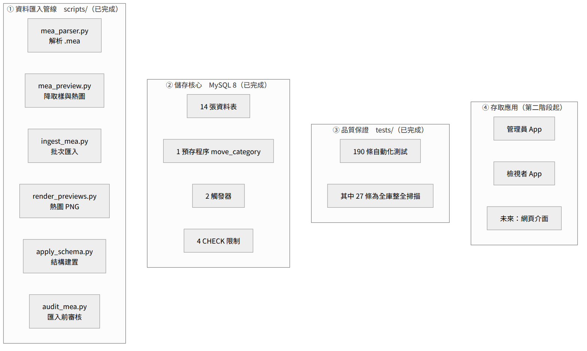
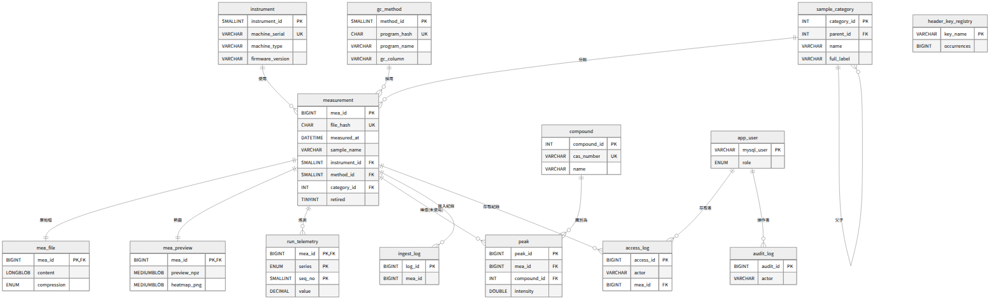
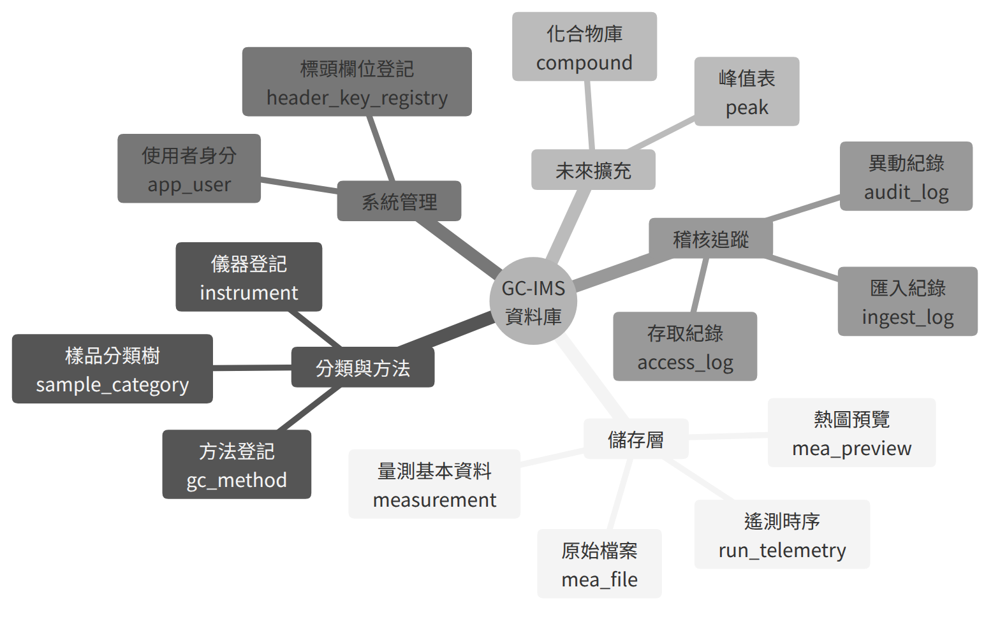
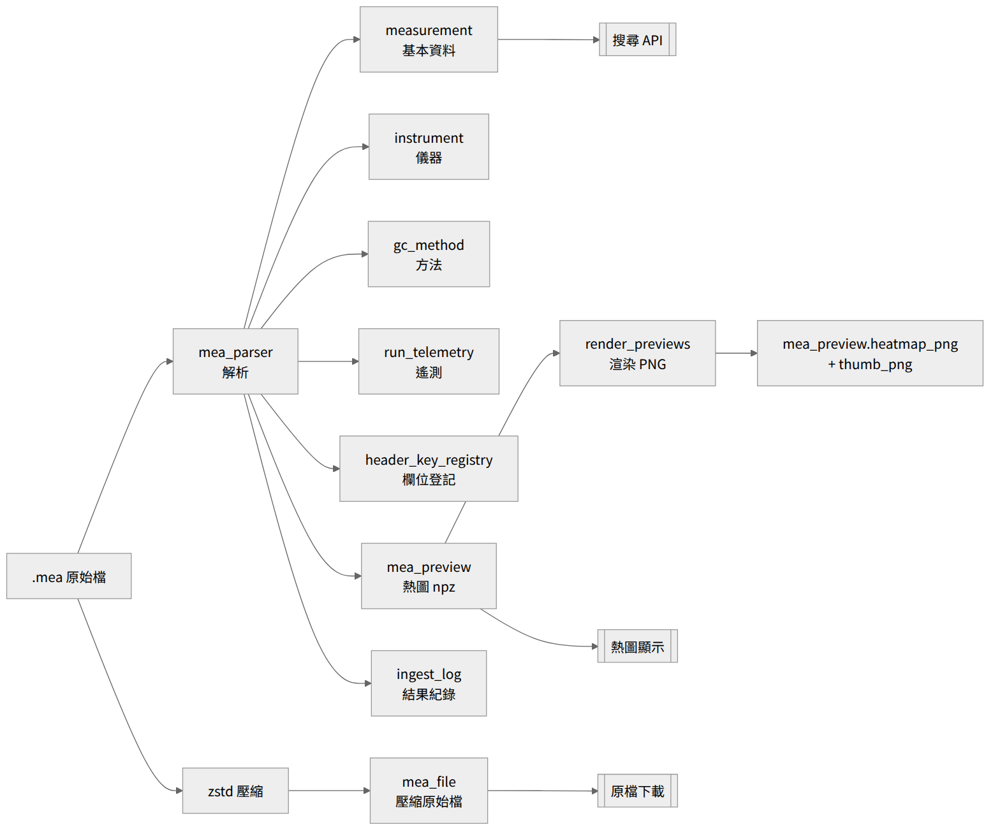
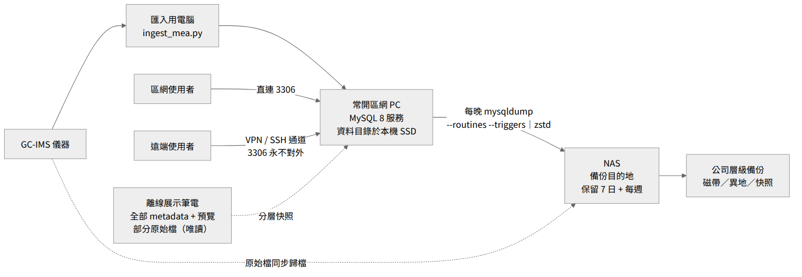

<!-- Version 1.1 -->
# GC-IMS 量測資料庫系統　專案報告

**版本**：1.1（新增批次校正模型）

**撰寫日期**：2026 年 9 月 9 日

**適用對象**：管理階層、部門主管，以及非資訊背景之研究與工程人員

**專案性質**：實驗室量測資料集中管理系統

**依據文件**：`docs/DESIGN.md`（設計決策紀錄）、`schema/gcims_schema.sql`（資料庫定義）、`CLAUDE.md`（開發約束）、`README.md`（版本狀態）

> **v1.1 主要更新**：新增 `batch` 資料表與 `measurement.batch_id` 外部鍵，銜接每個資料夾內的 BLANK.mea（背景／品管）與 STD.mea（Ketone Mix 6，C4–C9 保留指數校正）檔案；匯入程式自動建立批次並連結校正檔；`sample_type_from_name()` 補齊對 Testmix／Ketone Mix 命名的辨識規則。詳見 §5.15、§6.7、§8.7、§9.2。

## 目錄

- [執行摘要](#執行摘要)

- [一、專案背景與目標](#一專案背景與目標)

- [二、系統總覽](#二系統總覽)

- [三、資料庫架構總覽](#三資料庫架構總覽)

- [四、資料庫關聯與結構圖](#四資料庫關聯與結構圖)

- [五、資料表詳細規格](#五資料表詳細規格)

- [六、關鍵技術決策](#六關鍵技術決策)

- [七、跨世代交叉驗證](#七跨世代交叉驗證)

- [八、程式模組說明](#八程式模組說明)

- [九、測試與品質保證](#九測試與品質保證)

- [十、資料保護、權限與稽核](#十資料保護權限與稽核)

- [十一、部署、備份與遠端存取](#十一部署備份與遠端存取)

- [十二、效能與容量](#十二效能與容量)

- [十三、效益與未來藍圖](#十三效益與未來藍圖)

- [附錄 A：技術規格摘要](#附錄-a技術規格摘要)

- [附錄 B：韌體標頭欄位別名對照表](#附錄-b韌體標頭欄位別名對照表)

- [附錄 C：名詞對照](#附錄-c名詞對照)

## 執行摘要

本專案為 G.A.S. FlavourSpec 與 GC-IMS 氣相層析離子遷移光譜儀所產生的 `.mea` 量測檔案，建立一套集中式資料庫系統。原本散落於儀器主機、個人電腦、隨身碟與 NAS 的量測資料，全部收納於單一 MySQL 8 資料庫，並提供條件搜尋、熱圖快速瀏覽、 原始檔案位元級保存，以及以資料庫帳號為基礎的權限與稽核機制。

版本 1.1 已完成的範圍是**資料庫本體、匯入管線與批次校正模型**，桌面應用程式列為第二階段。 以下為可查核的完成狀態：

  ------------------------------------------------------------------------------------------------------------------------

  項目               數值                                                                       佐證來源

  ------------------ -------------------------------------------------------------------------- --------------------------

  資料表             15 張（v1.1 新增 batch），另含 1 個預存程序、2 個觸發器、4 個 CHECK 限制                      `gcims_schema.sql`

  端到端驗證         以 49 個真實量測檔組成的驗證資料集完成全流程實測，壓縮比 3.56 倍           匯入紀錄

  交叉驗證檔案型態   8 種，涵蓋 5 個韌體世代（2.16 / 2.29 / 2.52 / 4.73 / 4.82）與 2 條產品線   `DESIGN.md` §2b--§2g

  自動化測試         205 條全部通過，其中 30 條為對正式資料庫的整全掃描                         `README.md`、`tests/`

  原始檔案完整性     驗證資料集全數通過 SHA-256 解壓往返驗證                                    `test_integrity_scan.py`

  ------------------------------------------------------------------------------------------------------------------------

  : 表 0-1　版本 1.1 完成狀態摘要

本報告中所有資料量、批次時間與壓縮比，皆取自**為驗證管線而建立的測試資料集**， 用途是證明流程正確與量測效能，並不代表正式館藏的內容或規模。

三項最關鍵的設計立場，貫穿全系統：

1.  **資料庫是唯一真相來源。** `.mea` 原始檔案的位元組副本存放在資料庫內。 即使檔案系統毀損或 NAS 離線，資料庫本身即可完整還原每一筆量測。

2.  **未知不當作錯誤。** 新韌體出現前所未見的標頭欄位時，系統絕不拒絕匯入； 未知欄位全部收進 JSON 欄位並登記於欄位登記表，日後再決定是否單獨處理。 此立場已在 5 個韌體世代、8 種檔案型態上獲得驗證，期間資料庫結構零修改。

3.  **機器欄位與人工欄位嚴格分離。** 儀器讀出的數值可隨時重新產生； 使用者填寫的描述、備註、分類則由匯入程式完全不觸碰， 確保管線升級不會摧毀人工累積的註記。

本系統的任務邊界亦已明確固定：**它是集中化的** `.mea` **檔案庫，不是分析系統**。 峰值偵測與化合物比對屬於外部分析工具的職責，本資料庫提供資料給它們讀取 （`DESIGN.md` §18）。`peak` 與 `compound` 兩張表保留為空表， 供未來分析結果回寫時免於資料庫遷移。

## 一、專案背景與目標

### 1.1 專案開始前的實際問題

  -----------------------------------------------------------------------------------------------------------------------------

  問題             具體情形                                                    後果

  ---------------- ----------------------------------------------------------- ------------------------------------------------

  檔案散落各地     資料存放於儀器主機、實驗人員個人電腦、NAS、外接硬碟         無法掌握完整館藏；人員離職或換機即可能永久遺失

  搜尋困難         「2024 年做過的茶葉樣品」需靠人力翻閱資料夾                 耗時且容易遺漏

  無法快速預覽     每次檢視熱圖都得開啟 40--150 MB 原始檔案                    單檔開啟需 1--3 秒，批次比對極為費時

  格式隨韌體變異   不同世代 `.mea` 標頭欄位名稱與數量不一致（51 至 70 個鍵）   自製小工具容易在新機器上失效

  無異動追蹤       實驗紀錄的描述、註記、分類若有修改，沒有留下歷史            無法追溯、無法回復

  -----------------------------------------------------------------------------------------------------------------------------

  : 表 1-1　專案啟動前的問題盤點

### 1.2 專案目標與可量化指標

  ---------------------------------------------------------------------------------------

  目標               具體指標

  ------------------ --------------------------------------------------------------------

  集中儲存           所有 `.mea` 檔案（原始位元組級精確保存）進入單一 MySQL 資料庫

  可搜尋             樣品名稱、日期、儀器、方法、樣品類別、分類樹節點、標頭欄位皆可查詢

  快速瀏覽           熱圖預覽自資料庫載入 \< 100 毫秒，較開啟原始檔案快約 50 倍

  資料完整性         SHA-256 雜湊驗證，確保取出時位元組與匯入時完全一致

  格式相容性         支援 5 個以上韌體世代；新韌體出現時可平滑擴充

  權限分離           管理員可改寫、標註員僅可註記、檢視者唯讀，且由資料庫層強制執行

  異動可追溯         所有寫入操作留下操作者、時間、舊值、新值

  ---------------------------------------------------------------------------------------

  : 表 1-2　專案目標與驗收指標

### 1.3 專案範疇與界線

本專案只做「量測資料的集中儲存與檢索」。以下三項**明確不做** （`DESIGN.md` §18 已列為正式決策）：

- **峰值偵測（peak detection）**：屬於外部分析工具的職責。

- **化合物比對（compound matching）**：同上。

- **資料品質判斷**：由分析人員自行判斷。

上述功能由公司內既有的 GC-IMS-PEAK 分析工具負責，該工具會從本資料庫讀取 原始檔案或熱圖預覽，自行執行分析，結果保留在其自己的世界中。

這條界線是刻意畫的：檔案庫與分析工具各自演進，只透過「取得一筆量測」這個 介面耦合。分析工具的演算法開發進度，不會阻擋檔案庫的交付。

未來若決定將分析結果回寫入庫（`DESIGN.md` §18「喚醒條款」），已預先固定三條規則：

1.  回寫是分析工具的**明確動作**，永遠不會混入匯入流程。

2.  結果必須攜帶分析版本識別碼（`analysis_ver`）；v1 與 v2 的識別結果並存、 可比較、互不覆寫。

3.  回寫結果屬於機器欄位（可刪除、可重新產生）；未來若加入「分析師已確認」 欄位，該欄位屬人工欄位，受永不覆寫保護。

## 二、系統總覽

### 2.1 系統組成

版本 1.1 交付的是下圖中的前三個區塊（含批次校正模型）；存取應用列於第二階段。

{width="6.102361111111111in" height="3.65051946631671in"}

### 2.2 `.mea` 檔案格式與驗證基準

系統的所有解析邏輯，都建立在對真實檔案的實測結果之上，而非廠商文件的假設。 下表為基準檔案（型態 1）的實測數據（`DESIGN.md` §2）：

  ----------------------------------------------------------------------------------------

  項目                       實測值

  -------------------------- -------------------------------------------------------------

  檔案總長度                 77,144,541 位元組

  標頭區                     5,541 位元組，latin-1 文字，60 行 `key = value`

  矩陣區                     int16 小端序，8,571 光譜 × 4,500 漂移點（位元組數完全吻合）

  漂移軸                     4,500 點 @ 150 kHz＝30.0 ms 掃描週期

  層析軸                     8,571 chunk × 30 ms × 6 次疊加 ≈ 25.7 分鐘

  RIP 反應離子峰             漂移索引約 1,216；此檔訊號為負向（極值 −464）

  zstd 壓縮（等級 3）        77.1 MB → 18.9 MB（4.1 倍）

  熱圖預覽                   max-pool (12, 6) → 714 × 750，npz 約 367 KB

  ----------------------------------------------------------------------------------------

  : 表 2-1　基準檔案實測數據（型態 1：`260210_095729_FISH_MEAT_BLANK.mea`）

必須強調：**標頭的欄位集合會隨機型、韌體與自動進樣器組態而變動**， 因此系統從不將「60 個欄位」寫死為必要條件。實際觀察到的欄位數介於 51 至 70 個之間。

### 2.3 資料匯入處理流程

一份 `.mea` 檔案從進入系統到可供查詢，經過以下九個步驟（`DESIGN.md` §5）。 單檔處理時間約 3--5 秒（90 MB 檔案實測約 5 秒）。

  --------------------------------------------------------------------------------------------------------------------------

  步驟   動作                                         產出

  ------ -------------------------------------------- ----------------------------------------------------------------------

  1      讀入位元組並計算 SHA-256                     重複檔判定依據

  2      切割標頭與矩陣（算術回推＋啟發式交叉驗證）   標頭文字區、int16 矩陣

  3      解析標頭、白名單升級欄位、登記儀器與方法     `measurement`、`instrument`、`gc_method`

  4      全部標頭鍵存入 JSON，新鍵登記                `header_json`、`header_key_registry`

  5      展開空白分隔的時序陣列                       `run_telemetry`

  6      定位 RIP（VOCal 相容）並判定極性             `rip_drift_index`、`rip_drift_ms`、`polarity`

  7      max-pool 降取樣一次並打包                    `mea_preview.preview_npz`

  8      zstd 壓縮原始檔案                            `mea_file.content`

  9      寫入匯入結果                                 `ingest_log`（ok／duplicate／parse_error／failed／ok_with_warnings）

  延後   由 `render_previews.py` 產生熱圖與縮圖       `heatmap_png`、`thumb_png`、`png_render_ver`

  --------------------------------------------------------------------------------------------------------------------------

  : 表 2-2　匯入管線的九個步驟與產出

其中第 8 步「產生熱圖」刻意與匯入分離為兩段式：匯入只做一次降取樣並存成 npz， 熱圖 PNG 由獨立程式後續產生。這樣做的兩個理由是：

- **配方可反覆調整**：更換配色、裁切百分位、對數尺度，或日後加入保留指數（RI） 校正時，都不需要重新解壓 40--150 MB 的原始檔案（匯入速度因此提升約 40%）。

- **產生時機可延後**：RI 軸需要每批次的標準品資料，而該資料在匯入當下未必存在； 延後產生可在校正資料到位後再套用。

### 2.4 核心設計原則

  -------------------------------------------------------------------------------------------------------------------------------------------------------------------------------------------------

  原則                         內容                                                                                                                    實作位置

  ---------------------------- ----------------------------------------------------------------------------------------------------------------------- --------------------------------------------

  單一真相來源                 原始檔案位元組存於資料庫，檔案系統不可用時仍能完整還原                                                                  `mea_file.content`

  標頭四重保存                 約 22 個常用欄位升級為具型別的欄位；全部欄位原文存入 JSON；5 至 7 組時序陣列展開為長表；原始位元組完整保留              `measurement`、`run_telemetry`、`mea_file`

  未知欄位不失敗               未知鍵一律存入 JSON 並登記，永不造成匯入失敗                                                                            `header_key_registry`

  缺資料容忍、解析失敗不容忍   欄位「不存在」→ 靜默存 NULL；欄位「存在但解析不出來」→ 記警告並以可見的人工標記（`(unparsed)`）標示，絕不偽裝成正常值   `ingest_log`（`ok_with_warnings`）

  機器／人工欄位分離           描述、備註、分類僅由管理介面寫入，匯入程式永不覆寫                                                                      `DESIGN.md` §10

  派生資料可拋棄               除原始檔案外，一切派生資料（預覽、PNG、升級欄位）皆可重新產生                                                           `pipeline_ver`、`png_render_ver`

  軟刪除                       量測資料永不實體刪除，只標記退役，且由 GRANT 層面禁止 DELETE                                                            `retired` 系列欄位

  -------------------------------------------------------------------------------------------------------------------------------------------------------------------------------------------------

  : 表 2-3　貫穿全系統的七項設計原則

## 三、資料庫架構總覽

### 3.1 基本規格

  -----------------------------------------------------------------------------------

  項目                    內容

  ----------------------- -----------------------------------------------------------

  資料庫管理系統          MySQL 8.0.42（需 8.0.19 以上，預存程序內使用遞迴 CTE）

  字元集／排序規則        utf8mb4 / utf8mb4_0900_ai_ci

  正式資料庫名稱          `gc-ims_database`

  標準結構檔              `schema/gcims_schema.sql`（可套用至任意資料庫名稱）

  資料表                  14 張

  預存程序                1 個（`move_category`：分類樹搬移）

  觸發器                  2 個（阻擋分類節點自我父子）

  CHECK 限制              4 個（欄位級合理性檢查，由資料庫強制執行）

  伺服器設定要求          `max_allowed_packet` ≥ 256M；`innodb_file_per_table` = ON

  -----------------------------------------------------------------------------------

  : 表 3-1　資料庫基本規格

### 3.2 資料表分類

  -------------------------------------------------------------------------------------------------------------------------------------

  分類                   資料表                                                      用途

  ---------------------- ----------------------------------------------------------- --------------------------------------------------

  核心量測               `measurement`、`mea_file`、`mea_preview`、`run_telemetry`   每筆量測的搜尋資料、壓縮原檔、熱圖預覽、運行時序

  共享字典               `instrument`、`gc_method`、`sample_category`                儀器登記、層析方法登記、樣品分類樹

  系統管理               `app_user`、`header_key_registry`                           使用者身分層、標頭欄位登記

  稽核追蹤               `ingest_log`、`access_log`、`audit_log`                     匯入紀錄、高價值存取紀錄、異動紀錄

  批次校正（v1.1 新增） `batch`                                                     連結每個資料夾的 STD 與 BLANK 校正檔（見 §5.15）

  未來擴充（保留空表）   `peak`、`compound`                                          保留給外部分析結果回寫，目前不寫入

  -------------------------------------------------------------------------------------------------------------------------------------

  : 表 3-2　15 張資料表的功能分類

## 四、資料庫關聯與結構圖

本章三張圖以橫向版面呈現，以確保欄位文字可辨識。

> **v1.1 說明**：以下三張圖仍呈現 v1.0 的 14 張表結構。v1.1 新增的 `batch` 表
> 與 `measurement.batch_id` 關聯，請參閱 §5.15 的資料表定義；批次的角色說明
> 見 §6.7。

### 4.1 資料表關聯圖

{width="9.645669291338583in" height="2.9281496062992125in"}

### 4.2 資料庫功能腦圖

{width="7.480314960629921in" height="4.6179494750656165in"}

### 4.3 資料流向圖

{width="6.299212598425197in" height="5.286838363954506in"}

## 五、資料表詳細規格

本章逐表列出欄位定義。表格中「限制」欄標示 PK（主鍵）、FK（外部鍵）、 UK（唯一鍵）、IDX（索引）、CHECK（檢查限制）；「可空」欄標示是否允許 NULL。

### 5.1 `measurement`（量測主表）

**用途**：每一筆量測（一個 `.mea` 檔案）對應一列，是整個系統的中心表。 除搜尋條件外，亦保存矩陣幾何資訊，使系統可直接自壓縮原檔重建矩陣， 不必重新解析標頭。

**欄位總數**：34（含後續 ALTER 新增的來源、註記與退役欄位）

  ------------------------------------------------------------------------------------------------------------------------------------------------------------------------------

  \#   欄位名稱               資料型別                      可空   限制                        說明

  ---- ---------------------- ----------------------------- ------ --------------------------- ---------------------------------------------------------------------------------

  1    mea_id                 BIGINT UNSIGNED               否     PK，自動遞增                量測流水編號，永久不變

  2    file_name              VARCHAR(255)                  否                                 原始檔名

  3    file_hash              CHAR(64)                      否     UK（uk_hash）               原始位元組的 SHA-256，重複匯入的判準

  4    file_size_bytes        BIGINT UNSIGNED               否     CHECK                       原始檔案位元組數

  5    measured_at            DATETIME                      否     IDX（idx_time_id）          量測時間（標頭 Timestamp）

  6    instrument_id          SMALLINT UNSIGNED             否     FK → instrument             儀器編號

  7    method_id              SMALLINT UNSIGNED             否     FK → gc_method、IDX         層析方法編號

  8    sample_name            VARCHAR(255)                  否     IDX（idx_sample）           樣品名稱（標頭 Sample）

  9    sample_class           VARCHAR(64)                   是                                 樣品類別（標頭 Class）

  10   sample_type            ENUM（5 種）                  否     IDX（idx_type_time）        sample／blank／standard／qc／unknown，匯入時依檔名樣態判定

  11   status                 VARCHAR(16)                   是                                 狀態（已觀察到 valid、doubtful）

  12   header_bytes           INT UNSIGNED                  否     CHECK                       標頭區位元組數

  13   n_spectra              INT UNSIGNED                  否     CHECK                       光譜列數（層析時間軸）

  14   n_drift_points         INT UNSIGNED                  否     CHECK                       漂移軸資料點數

  15   matrix_dtype           VARCHAR(8)                    否     CHECK，預設 int16le         矩陣資料型別白名單

  16   chunk_averages         SMALLINT UNSIGNED             是                                 疊加次數

  17   sample_rate_khz        DECIMAL(7,2)                  是                                 取樣頻率（kHz）

  18   trig_repetition_ms     DECIMAL(7,3)                  是                                 觸發重複時間，即漂移掃描長度（ms）

  19   run_time_s             DECIMAL(8,1)                  是                                 總運行時間（秒），由幾何值推算

  20   ambient_pressure_kpa   DECIMAL(7,3)                  是                                 環境壓力，取 `Pressure Ambient` 時序陣列平均；韌體 2.16／2.29 無此陣列時為 NULL

  21   polarity               ENUM('positive','negative')   是                                 訊號極性，逐檔由矩陣偵測（標頭無任何欄位可判斷）

  22   rip_drift_index        INT UNSIGNED                  是     CHECK                       RIP 於漂移軸的索引位置

  23   rip_drift_ms           DECIMAL(8,4)                  是                                 RIP 對應漂移時間（ms）

  24   header_json            JSON                          否                                 全部標頭欄位原文（完整性層）

  25   created_at             TIMESTAMP                     是     預設現在時間                匯入時間

  26   full_path              VARCHAR(1024)                 是                                 匯入來源完整路徑

  27   folder_name            VARCHAR(255)                  是     IDX（idx_folder）           父資料夾名稱（實驗室資料夾常帶批次語意）

  28   description            VARCHAR(512)                  是                                 人工欄位：樣品描述

  29   note                   TEXT                          是                                 人工欄位：備註

  30   category_id            INT UNSIGNED                  是     FK → sample_category、IDX   人工欄位：分類節點

  31   retired                TINYINT(1)                    否     IDX、CHECK，預設 0          軟刪除旗標（1 = 已退役）

  32   retired_at             DATETIME                      是     CHECK                       退役時間

  33   retired_by             VARCHAR(64)                   是     CHECK                       退役操作者

  34   retired_reason         VARCHAR(255)                  是                                 退役原因

  ------------------------------------------------------------------------------------------------------------------------------------------------------------------------------

  : 表 5-1　`measurement` 欄位定義

### 5.2 `mea_file`（原始檔案表）

**用途**：儲存 `.mea` 檔案的壓縮原始位元組，是整個系統的最終依據。 本表只做新增與刪除，永不更新（避免 binlog 體積倍增）。

  ----------------------------------------------------------------------------------------------------

  \#   欄位名稱      資料型別                     可空   限制                   說明

  ---- ------------- ---------------------------- ------ ---------------------- ----------------------

  1    mea_id        BIGINT UNSIGNED              否     PK、FK → measurement   對應量測編號

  2    compression   ENUM('none','zstd','gzip')   否     預設 zstd              壓縮演算法

  3    orig_size     BIGINT UNSIGNED              否                            原始位元組數

  4    stored_size   BIGINT UNSIGNED              否                            壓縮後位元組數

  5    content       LONGBLOB                     否                            壓縮後的完整原始檔案

  6    stored_at     TIMESTAMP                    是     預設現在時間           儲存時間

  ----------------------------------------------------------------------------------------------------

  : 表 5-2　`mea_file` 欄位定義

### 5.3 `mea_preview`（熱圖預覽表）

**用途**：儲存降取樣後的矩陣與已渲染的熱圖影像。降取樣採 max-pool （最大值池化）而非抽樣，因為 GC-IMS 峰寬僅 5--10 個漂移點， 抽樣會直接漏掉峰、池化則保留。

  ----------------------------------------------------------------------------------------------------------------------------------

  \#   欄位名稱         資料型別            可空   限制                   說明

  ---- ---------------- ------------------- ------ ---------------------- ----------------------------------------------------------

  1    mea_id           BIGINT UNSIGNED     否     PK、FK → measurement   對應量測編號

  2    preview_npz      MEDIUMBLOB          否                            降取樣矩陣＋時間軸＋漂移軸（numpy 壓縮格式），互動檢視層

  3    heatmap_png      MEDIUMBLOB          是                            已渲染熱圖（原生預覽解析度），詳細頁顯示層

  4    thumb_png        MEDIUMBLOB          是                            約 260 px 寬縮圖，清單牆顯示層

  5    png_render_ver   SMALLINT UNSIGNED   是                            渲染配方版本，供選擇性重製

  6    prev_rows        SMALLINT UNSIGNED   否                            降取樣後列數

  7    prev_cols        SMALLINT UNSIGNED   否                            降取樣後行數

  8    pool_rt          SMALLINT UNSIGNED   否                            時間軸池化倍率

  9    pool_dt          SMALLINT UNSIGNED   否                            漂移軸池化倍率

  10   pipeline_ver     SMALLINT UNSIGNED   否     預設 1                 匯入管線版本

  ----------------------------------------------------------------------------------------------------------------------------------

  : 表 5-3　`mea_preview` 欄位定義

### 5.4 `instrument`（儀器登記表）

**用途**：登記每一台儀器的固定屬性，同一台儀器的多次量測共用一列。

  -------------------------------------------------------------------------------------------------------------------------------

  \#   欄位名稱           資料型別            可空   限制              說明

  ---- ------------------ ------------------- ------ ----------------- ----------------------------------------------------------

  1    instrument_id      SMALLINT UNSIGNED   否     PK，自動遞增      儀器編號

  2    machine_type       VARCHAR(64)         否                       機型字串，原文保存（FlavourSpec®／FlavourSpecR／GC-IMS）

  3    machine_serial     VARCHAR(32)         否     UK（uk_serial）   機器序號

  4    machine_name       VARCHAR(64)         是                       機器名稱

  5    adio_serial        VARCHAR(32)         是                       ADIO 模組序號

  6    firmware_version   VARCHAR(16)         是                       韌體版本

  7    firmware_date      DATE                是                       韌體日期（多種格式解析，失敗則 NULL）

  8    drift_tube_um      INT UNSIGNED        是                       漂移管長度（µm）

  9    drift_voltage_v    DECIMAL(7,1)        是                       漂移電壓（V）

  10   sensor_data        VARCHAR(128)        是                       感測器資訊（如放射源）

  -------------------------------------------------------------------------------------------------------------------------------

  : 表 5-4　`instrument` 欄位定義

### 5.5 `gc_method`（層析方法表）

**用途**：登記每一種層析方法。以 `program_hash`（方法字串＋管柱＋漂移氣體的 SHA-256）去重，因此同名但參數經過修改的方法會成為不同列， 可回答「哪一版方法產生了這批資料」。

  -----------------------------------------------------------------------------------------------------------------------------------------------------------

  \#   欄位名稱                   資料型別            可空   限制               說明

  ---- -------------------------- ------------------- ------ ------------------ -----------------------------------------------------------------------------

  1    method_id                  SMALLINT UNSIGNED   否     PK，自動遞增       方法編號

  2    program_name               VARCHAR(64)         是                        方法名稱；標頭無此鍵時為 NULL，有值但無法解析時記為 `(unparsed)` 並發出警告

  3    program_raw                TEXT                是                        完整方法字串原文

  4    gc_column                  VARCHAR(128)        是                        層析管柱

  5    drift_gas                  VARCHAR(32)         是                        漂移氣體

  6    flow_ims_setpoint_ml_min   DECIMAL(6,1)        是                        IMS（漂移氣）流量設定

  7    flow_gc_setpoint_ml_min    DECIMAL(6,1)        是                        GC（載氣）流量設定

  8    temp_setpoints_c           JSON                是                        溫度設定（T1--T6）

  9    program_hash               CHAR(64)            否     UK（uk_program）   方法內容雜湊，去重依據

  -----------------------------------------------------------------------------------------------------------------------------------------------------------

  : 表 5-5　`gc_method` 欄位定義

### 5.6 `run_telemetry`（運行遙測表）

**用途**：將標頭中以空白分隔的時序陣列展開為長表格式。這些資料若留在 JSON 字串內，「找出 EPC2 壓力曾超過某值的批次」這類品保查詢將無法執行。 時間軸不另存，以 `seq_no × 記錄間隔` 推算（記錄間隔隨韌體變動， 已觀察到 12.1 s、18 s、21 s，一律自標頭讀取）。

  ----------------------------------------------------------------------------------------------------------------------------------------------------------

  \#   欄位名稱   資料型別            可空   限制                        說明

  ---- ---------- ------------------- ------ --------------------------- -----------------------------------------------------------------------------------

  1    mea_id     BIGINT UNSIGNED     否     PK 之一、FK → measurement   對應量測編號

  2    series     ENUM（7 種）        否     PK 之一                     flow_ims／flow_gc／press_ims／press_gc／press_ambient／pump1_flow／pump1_pressure

  3    seq_no     SMALLINT UNSIGNED   否     PK 之一                     時序編號（0, 1, 2, ...）

  4    value      DECIMAL(10,3)       否                                 數值

  ----------------------------------------------------------------------------------------------------------------------------------------------------------

  : 表 5-6　`run_telemetry` 欄位定義

### 5.7 `sample_category`（樣品分類樹）

**用途**：以相鄰串列（adjacency list）加上物化路徑，管理多層樣品分類 （例如「酒類 → 威士忌 → 單一麥芽 → 山崎 12 年」）。每筆量測可掛在任一層節點。

  -----------------------------------------------------------------------------------------------------------

  \#   欄位名稱      資料型別            可空   限制                           說明

  ---- ------------- ------------------- ------ ------------------------------ ------------------------------

  1    category_id   INT UNSIGNED        否     PK，自動遞增                   分類編號

  2    parent_id     INT UNSIGNED        是     FK 自參考、IDX                 上層節點（NULL 為根節點）

  3    name          VARCHAR(128)        否     UK（uk_sibling：同層不重名）   分類名稱

  4    full_label    VARCHAR(512)        否                                    完整路徑，供 O(1) 麵包屑顯示

  5    depth         SMALLINT UNSIGNED   否     預設 0                         節點深度

  6    sort_order    SMALLINT UNSIGNED   否     預設 0                         顯示排序

  -----------------------------------------------------------------------------------------------------------

  : 表 5-7　`sample_category` 欄位定義

### 5.8 `header_key_registry`（標頭欄位登記表）

**用途**：累計登記所有量測檔中曾出現過的標頭欄位名稱。這張表是增量維護的 「所有欄位聯集」，而非查詢時掃描 JSON 計算而得，因此介面可用一次 O(1) 查詢 取得完整可搜尋欄位清單，也是進階搜尋下拉選單的資料來源。

  ------------------------------------------------------------------------------------------------------------------

  \#   欄位名稱        資料型別          可空   限制             說明

  ---- --------------- ----------------- ------ ---------------- ---------------------------------------------------

  1    key_name        VARCHAR(128)      否     PK               標頭欄位名稱

  2    first_seen_at   TIMESTAMP         是     預設現在時間     首次出現時間

  3    first_mea_id    BIGINT UNSIGNED   是                      首次出現於哪筆量測

  4    sample_value    VARCHAR(255)      是                      範例值

  5    occurrences     BIGINT UNSIGNED   是     預設 1           累計出現次數（語意為「曾出現」，刪除不遞減）

  6    disposition     ENUM（4 種）      是     預設 json_only   處置方式：json_only／promoted／telemetry／ignored

  ------------------------------------------------------------------------------------------------------------------

  : 表 5-8　`header_key_registry` 欄位定義

### 5.9 `ingest_log`（匯入紀錄表）

**用途**：每一次匯入嘗試都留下一列，包含成功、重複、解析錯誤、失敗、 帶警告成功五種結果。管理介面據此提供「待處理警告」清單。

  ----------------------------------------------------------------------------------------------------------------------

  \#   欄位名稱       資料型別            可空   限制             說明

  ---- -------------- ------------------- ------ ---------------- ------------------------------------------------------

  1    log_id         BIGINT UNSIGNED     否     PK，自動遞增     紀錄編號

  2    mea_id         BIGINT UNSIGNED     是     IDX（idx_mea）   對應量測編號（失敗時為 NULL）

  3    file_name      VARCHAR(255)        否                      匯入檔名

  4    result         ENUM（5 種）        否                      ok／duplicate／parse_error／failed／ok_with_warnings

  5    message        VARCHAR(512)        是                      詳細訊息（重複檔的新檔名亦記於此）

  6    pipeline_ver   SMALLINT UNSIGNED   否                      匯入管線版本

  7    ingested_at    TIMESTAMP           是     預設現在時間     匯入時間

  ----------------------------------------------------------------------------------------------------------------------

  : 表 5-9　`ingest_log` 欄位定義

### 5.10 `app_user`（使用者身分表）

**用途**：混合式身分模型的身分層。認證與硬性權限由 MySQL 個人帳號與 GRANT 負責；本表儲存顯示名稱、角色與啟用狀態等業務屬性。

  ---------------------------------------------------------------------------------------------------------

  \#   欄位名稱       資料型別       可空   限制           說明

  ---- -------------- -------------- ------ -------------- ------------------------------------------------

  1    mysql_user     VARCHAR(32)    否     PK             對應的 MySQL 帳號

  2    display_name   VARCHAR(64)    否                    顯示名稱

  3    role           ENUM（3 種）   否                    admin／annotator／viewer，決定介面功能開放範圍

  4    active         TINYINT(1)     否     預設 1         0 = 停用，登入即拒絕（不必動 GRANT）

  5    created_at     TIMESTAMP      是     預設現在時間   建立時間

  ---------------------------------------------------------------------------------------------------------

  : 表 5-10　`app_user` 欄位定義

### 5.11 `access_log`（存取紀錄表）

**用途**：只紀錄「下載原始檔」與「取用全解析度資料」兩種高價值存取。 搜尋與熱圖瀏覽刻意不紀錄，以免噪音淹沒真正需要追溯的行為。

  ---------------------------------------------------------------------------------------------------

  \#   欄位名稱      資料型別          可空   限制               說明

  ---- ------------- ----------------- ------ ------------------ ------------------------------------

  1    access_id     BIGINT UNSIGNED   否     PK，自動遞增       存取編號

  2    actor         VARCHAR(32)       否     IDX（idx_actor）   存取者 MySQL 帳號

  3    mea_id        BIGINT UNSIGNED   否     IDX（idx_mea）     存取的量測編號

  4    action        ENUM（2 種）      否                        download_original／full_resolution

  5    accessed_at   TIMESTAMP         是     預設現在時間       存取時間

  ---------------------------------------------------------------------------------------------------

  : 表 5-11　`access_log` 欄位定義

### 5.12 `audit_log`（異動紀錄表）

**用途**：紀錄管理介面的每一次寫入，含舊值與新值，供事後追溯與錯誤回復。 檢視者帳號對本表沒有任何權限。

  -----------------------------------------------------------------------------

  \#   欄位名稱     資料型別          可空   限制                說明

  ---- ------------ ----------------- ------ ------------------- --------------

  1    audit_id     BIGINT UNSIGNED   否     PK，自動遞增        稽核編號

  2    actor        VARCHAR(64)       否                         操作者

  3    action       VARCHAR(32)       否                         動作類型

  4    target_tbl   VARCHAR(64)       否     IDX（idx_target）   異動的資料表

  5    target_id    BIGINT UNSIGNED   否     IDX（idx_target）   異動的資料列

  6    old_value    TEXT              是                         舊值

  7    new_value    TEXT              是                         新值

  8    acted_at     TIMESTAMP         是     預設現在時間        異動時間

  -----------------------------------------------------------------------------

  : 表 5-12　`audit_log` 欄位定義

### 5.13 `peak`（峰值表，保留空表）

**用途**：目前不寫入。保留給未來外部分析工具回寫識別結果。 其中 `dt_rip_rel`（相對 RIP 的漂移時間）是關鍵欄位：絕對漂移時間會隨溫度與 壓力漂移，唯有經 RIP 正規化後的數值可跨批次比較。

  ------------------------------------------------------------------------------------------------------------------------

  \#   欄位名稱       資料型別            可空   限制                             說明

  ---- -------------- ------------------- ------ -------------------------------- ----------------------------------------

  1    peak_id        BIGINT UNSIGNED     否     PK，自動遞增                     峰值編號

  2    mea_id         BIGINT UNSIGNED     否     FK → measurement                 對應量測

  3    rt_s           DECIMAL(8,2)        否     IDX（idx_window）                保留時間（秒）

  4    dt_ms          DECIMAL(8,4)        否                                      絕對漂移時間（ms）

  5    dt_rip_rel     DECIMAL(8,5)        否     IDX（idx_window）                相對 RIP 的漂移時間

  6    intensity      DOUBLE              否                                      峰強度

  7    volume         DOUBLE              是                                      峰體積

  8    fwhm_rt_s      DECIMAL(7,2)        是                                      時間軸半高寬

  9    fwhm_dt_ms     DECIMAL(7,4)        是                                      漂移軸半高寬

  10   ion_form       ENUM（4 種）        是     預設 unknown                     離子形態

  11   detector_ver   SMALLINT UNSIGNED   否     預設 0                           偵測演算法版本

  12   compound_id    INT UNSIGNED        是     FK → compound、IDX（idx_cmpd）   識別出的化合物（未識別為 NULL 屬正常）

  ------------------------------------------------------------------------------------------------------------------------

  : 表 5-13　`peak` 欄位定義

### 5.14 `compound`（化合物表，保留空表）

**用途**：目前不寫入。未來的化合物參考資料庫。

  ---------------------------------------------------------------------------------------

  \#   欄位名稱         資料型別       可空   限制              說明

  ---- ---------------- -------------- ------ ----------------- -------------------------

  1    compound_id      INT UNSIGNED   否     PK，自動遞增      化合物編號

  2    name             VARCHAR(255)   否     IDX（idx_name）   化合物名稱

  3    cas_number       VARCHAR(20)    是     UK（uk_cas）      CAS 登錄號

  4    formula          VARCHAR(64)    是                       分子式

  5    ri               DECIMAL(7,1)   是                       保留指數

  6    dt_rip_rel_ref   DECIMAL(8,5)   是                       相對 RIP 漂移時間參考值

  ---------------------------------------------------------------------------------------

  : 表 5-14　`compound` 欄位定義

### 5.15 `batch`（批次表，v1.1 新增）

**用途**：將同一批同時進行的量測收攏在一起，並指定該批次的 BLANK.mea
（背景／品管）與 STD.mea（Ketone Mix 6, C4–C9 保留指數校正）檔案。使得
每筆樣品可以依所屬批次的專屬校正做座標轉換（RT → RI）與背景扣除，
讓跨批次的資料回到相同的比較刻度。

**設計要點**：

- 一個批次通常對應一個資料夾——因為現場工作流程即為「一個資料夾 = 一批
  同時進行的量測」。
- BLANK.mea 與 STD.mea **儲存方式與樣品完全相同**——同樣寫入
  `measurement`／`mea_file`／`mea_preview`／`run_telemetry` 四張表，同樣經
  zstd 壓縮，同樣產生預覽 PNG。差異僅在 `sample_type` 欄位（`blank` 或
  `standard`）。`batch` 表僅儲存 `mea_id` 指標，不複製檔案位元組。
- `std_mea_id` 與 `blank_mea_id` 皆可為 NULL——歷史資料夾常缺其中一或兩個
  校正檔，系統依「絕不因缺件報錯」的原則優雅退化：有 STD 才做 RI 軸轉換，
  有 BLANK 才做背景扣除，兩者皆無仍可搜尋與瀏覽，僅無法做這兩項處理。

| #  | 欄位名稱     | 資料型別        | 可空 | 限制                        | 說明 |
|----|--------------|-----------------|------|-----------------------------|------|
| 1  | batch_id     | INT UNSIGNED    | 否   | PK，自動遞增                | 批次編號 |
| 2  | label        | VARCHAR(255)    | 否   | UK（uk_batch_label）        | 批次標籤（匯入時等於 folder_name） |
| 3  | std_mea_id   | BIGINT UNSIGNED | 是   | FK → measurement，IDX       | 本批次的 STD.mea 指標 |
| 4  | blank_mea_id | BIGINT UNSIGNED | 是   | FK → measurement，IDX       | 本批次的 BLANK.mea 指標 |
| 5  | created_at   | TIMESTAMP       | 是   | 預設值：現在時間            | 建立時間 |
| 6  | notes        | TEXT            | 是   |                             | 批次備註（如「M3 為主要校正」） |

: 表 5-15　batch 欄位定義

**外部鍵刪除規則**：`std_mea_id` 與 `blank_mea_id` 均為 `ON DELETE SET NULL`。
若刪除校正量測，batch 本身保留，只是失去該校正的連結。`measurement.batch_id`
也是 `ON DELETE SET NULL`：刪除批次不會刪除該批的樣品，只是它們失去所屬批次。

**同時，`measurement` 表新增一欄位** `batch_id`（可為空、FK 到 batch，
索引為 `idx_batch`），讓每筆量測都能反查所屬批次。

**匯入時的自動處理**（見 §8.3、§8.7）：

1. 依 folder_name 找出（或建立）對應的 batch。
2. 將此量測的 `batch_id` 指向該 batch。
3. 若此量測分類為 `standard` 且 batch 尚未指定 STD，指定之。
4. 若此量測分類為 `blank` 且 batch 尚未指定 BLANK，指定之。
5. 既有指標**不會**被匯入程序覆寫（避免自動化蓋掉手動調整）。

**驗證資料集的實際狀況**：

| 資料夾                | 檔案數 | BLANK | STD | 狀態 |
|-----------------------|--------|-------|-----|------|
| `20260826_茶葉 樣品`  | 22     | 1     | 1   | **完整**（可做 RI 軸與背景扣除） |
| `demo-ketones`        | 7      | 2     | 5   | **完整**（`Testmix*` 於 v1.1 補齊分類） |
| `juice2014-10-23`     | 13     | 1     | 0   | 部分（僅可背景扣除） |
| `5F1-00554`           | 2      | 0     | 0   | 無（僅供瀏覽） |
| `mea_1H1-00088`       | 4      | 0     | 0   | 無 |
| `TEA`                 | 1      | 0     | 1   | 部分（僅可 RI 軸） |

: 表 5-15-2　驗證資料集內 6 個批次的校正檔覆蓋度

### 5.16 預存程序、觸發器與 CHECK 限制

**預存程序** `move_category(node_id, new_parent_id)` 是搬移分類節點的唯一合法途徑。 它以遞迴查詢檢查目標父節點是否為節點本身或其任一子孫，若是則拒絕， 藉此阻止 A→B→C→A 這類循環。應用程式一律呼叫此程序， 絕不直接執行 `UPDATE parent_id`。

**觸發器** `trg_cat_ins_no_self` **與** `trg_cat_upd_no_self` 在新增與更新時阻擋 自我父子。MySQL 的限制是觸發器不能查詢自身所屬的資料表（錯誤 1442）， 因此多層循環偵測無法在觸發器內完成，只能靠上述預存程序； 觸發器的價值在於連手動以 SQL 用戶端修改也擋得住。

  ----------------------------------------------------------------------------------------------------------------------------------------------

  名稱                              檢查內容                                                          目的

  --------------------------------- ----------------------------------------------------------------- ------------------------------------------

  `ck_meas_geometry`                file_size_bytes = header_bytes + n_spectra × n_drift_points × 2   位元組數學恆等，保證矩陣可精確重組

  `ck_meas_retired_consistency`     退役旗標與退役時間／操作者必須同時具備或同時為空                  語意一致，杜絕半套退役狀態

  `ck_meas_rip_index_within_axis`   RIP 索引為 NULL 或小於漂移軸點數                                  阻擋越界索引

  `ck_meas_matrix_dtype`            矩陣型別必須在白名單內（目前僅 int16le）                          未來新增型別必須明確放寬，形成刻意的阻力

  ----------------------------------------------------------------------------------------------------------------------------------------------

  : 表 5-15　四項 CHECK 限制

上述限制由 MySQL 8 在每次 INSERT／UPDATE 時自動執行，不依賴應用程式， 違規時拋出錯誤 3819。

## 六、關鍵技術決策

本章說明六項對系統可靠度影響最大的決策，及其選擇理由。 完整決策紀錄見 `docs/DESIGN.md`。

### 6.1 標頭與二進位的切割：雙方法交叉驗證

`.mea` 是「文字標頭＋二進位矩陣」的複合檔案，切割點若判斷錯誤， 整個矩陣即告報廢。系統同時採用兩種方法並要求兩者一致：

  -------------------------------------------------------------------------------------------------------------------------------------------------------

  方法                   作法                                                                          特性

  ---------------------- ----------------------------------------------------------------------------- --------------------------------------------------

  主要方法（算術回推）   邊界 = 檔案長度 − 光譜數 × 漂移點數 × 2，兩個整數以正規表示式自前段文字取得   與內容無關，不受「看起來像文字的二進位資料」影響

  次要方法（啟發式）     尋找第一個非可列印位元組                                                      只作交叉驗證用

  -------------------------------------------------------------------------------------------------------------------------------------------------------

  : 表 6-1　標頭／二進位切割的雙方法設計

兩法差距須在數個位元組以內（實測差為 1，即最後一個換行符）； 不一致時直接記為 `parse_error` 交人工判讀，**絕不猜測**。 兩種方法的失效情境剛好互補：二進位開頭恰巧可列印時只有啟發式失效， 而檔尾若有附加區塊則只有算術法失效。此設計已在全部 8 種檔案型態上 達成位元組精確驗證。

### 6.2 RIP 定位：與外部分析工具對齊

RIP（反應離子峰）是漂移軸的原點基準。本系統刻意採用與外部分析工具 GC-IMS-PEAK 相同、亦即與 VOCal 相容的演算法： 取 RT=0 那一列，跳過前 200 個漂移取樣點後取絕對值最大者。

跨工具對齊的理由很實際：未來分析結果回寫時，外部工具計算的 `drift_relative = dt_index / rip_index` 會與資料庫儲存的 `rip_drift_index` 比對，兩邊若用不同的 RIP 定位法，每一個峰的位置都會錯開。

在參考演算法之上，本系統另加兩項：

- 由該點的**帶號值**判定訊號極性，寫入 `polarity`。

- **弱 RIP 警示**：若最大值未達同區間中位數的 3 倍，匯入結果標記為 `ok_with_warnings`，檔案仍照常匯入，但提醒管理員複查。

歷史紀錄（保留供參考）：早期版本採用漂移軸 0.15--0.40 區間的視窗式 argmax，起因是某個檔案的前緣暫態尖峰使無約束 argmax 落在索引 18。 現行方法以「跳過前 200 點」同樣排除該情形，且額外達成跨工具對齊， 因此取代了原設計。

### 6.3 訊號極性：只能逐檔判定

這是交叉驗證過程中最重要的發現。同一台儀器（序號 1H1-00088）、 同一韌體（2.52）、完全相同的 60 個標頭欄位、連 Class 欄位都相同的兩個檔案， 其中一個訊號為負向（RIP −464），另一個為正向（RIP +855）。 逐欄位比對後，**找不到任何標頭欄位可以區分兩者**。

跨三個世代的觀察同樣支持此結論：韌體 2.16 為正向、2.52 為負向、4.82 為正向， 不存在「某韌體必為某極性」的規則。

結論（已定案）：極性無法由標頭在任何粒度上判定，只能自矩陣資料偵測。 `measurement.polarity` 欄位因此為必要設計，而非備而不用。

### 6.4 欄位升級準則：欄位或 JSON

每一個標頭鍵都要決定「升級為具型別的資料庫欄位」或「留在 JSON」。 判斷階梯如下：

1.  這個鍵會出現在 WHERE／ORDER BY／JOIN 嗎？不會 → JSON（多數鍵停在這一關）。

2.  會，但頻率高嗎？很少用 → JSON（必要時加函式索引）。

3.  需要型別語意（日期／數值比較、外鍵、列舉）嗎？需要 → 升級為欄位。

四個正當的升級理由：高頻搜尋條件、需要型別語意、參照完整性、 程式邏輯依賴（幾何欄位與極性即屬此類，與搜尋無關但重建矩陣必須用到）。

反面準則同樣重要：**「看起來很重要」不是理由**，重要不等於會被搜尋； **「升級比較保險」恰恰相反**------每一個欄位都是負債，需要處理跨韌體改名、 格式漂移與各世代的空值規則，而留在 JSON 的鍵零成本。 實證支持這點：約 22 個升級欄位在三個韌體世代間需要別名、改名與格式處理； 約 40 個留在 JSON 的鍵則完全不需要修改。

因此預設保守：不確定時先留 JSON，等登記表的出現次數與實際使用狀況 證明有需要，再以一次 ALTER 加一次回填升級。約 22／130 個鍵升級，比率約 17%。

### 6.5 兩段式熱圖產生

  -------------------------------------------------------------------------------------------------------------------------------------------------------

  階段               執行者                 讀取                                    寫入                                           耗時

  ------------------ ---------------------- --------------------------------------- ---------------------------------------------- ----------------------

  第一段（匯入時）   `ingest_mea.py`        原始矩陣                                `preview_npz`（一次 max-pool）                 含於匯入的 3--5 秒內

  第二段（延後）     `render_previews.py`   僅 `preview_npz` 與 `rip_drift_index`   `heatmap_png`、`thumb_png`、`png_render_ver`   約 0.4 秒／筆

  -------------------------------------------------------------------------------------------------------------------------------------------------------

  : 表 6-2　兩段式熱圖產生的職責分工

第二段從不觸碰 `mea_file`、`header_json`、`run_telemetry`， 更不會碰描述／備註／分類等人工欄位。更換配色或加入 RI 校正時， 只需提高渲染版本號並重跑第二段，全庫重製成本因此維持在可接受範圍。

三種影像形式各有其消費者：`preview_npz` 供互動式檢視（切換配色、 對數／線性、游標讀值）；`heatmap_png` 為原生解析度的成品圖， 供詳細頁與未來網頁 `` 直接使用；`thumb_png` 供清單牆使用 （50 筆清單以原生 PNG 計為 14 MB，以縮圖計則為 1.7 MB）。

### 6.6 向後相容規則

四類「已知的未知」------新遙測系列、新離子模式、其他儀器機型、 非 int16 資料型別------全部以**加法式、不破壞既有資料**的方式處理：

- **列舉（ENUM）演進規則**：新值只能加在尾端，絕不重排或插入中間 （MySQL 以序數儲存 ENUM，尾端追加是瞬時 DDL，重排會改變既有資料的意義）。

- **新屬性**：只允許 `ADD COLUMN ... NULL`，舊資料讀出 NULL， 語意為「當時未紀錄」，既有查詢完全不受影響。

- **資料型別演進**：`matrix_dtype` 欄位已預先存在，解析器只需擴充型別對照表； 由於每一列都自我描述（幾何、型別、極性、管線版本都隨列儲存）， 同一支解析器可同時服務新舊資料列。

- **最終保險**：原始檔案位元級保存，機器欄位皆可重新產生， 因此即使日後發現解析錯誤，也能靠重新推導修復。

`pump1_flow` 與 `pump1_pressure` 兩個遙測系列，正是依此規則在發現 GC-IMS 泵浦式產品線後，以尾端追加方式併入，既有資料零修改。

### 6.7 批次校正模型：連結樣品與其 BLANK／STD（v1.1 新增）

**設計立場**：分析現場的工作習慣是「一個資料夾對應一次批次量測，資料夾內
放一支 STD（Ketone Mix 6，C4–C9）用作 GC 保留指數 (RI) 校正，一支 BLANK
用作背景扣除與品管」。v1.0 將此三類檔案視為孤立列，v1.1 補上關聯：透過
新增的 `batch` 表（見 §5.15）與 `measurement.batch_id` 外部鍵，明確表達
「這筆樣品所屬批次的 STD 與 BLANK 是哪兩份 .mea」。

**為何選「經批次表間接連結」而非「樣品直接指向 STD／BLANK」**：

- 一批次通常包含 20 筆以上的樣品，若採直接連結則同一 STD／BLANK 之 mea_id
  會重複 20 次；一旦批次改用新校正檔，需 UPDATE 20 列同步修正，容易出錯。
- 批次本身是有意義的實體：可以有備註（`notes`）、可以有品管旗標、可以掛上
  時間範圍。日後擴充只需增加 batch 表欄位，不必觸碰 measurement 表。
- 透過批次表間接查詢只多一次 JOIN，效能不成問題。

**已建立的資料完整性守則**（實作於 `tests/test_integrity_scan.py`）：

- `batch.std_mea_id` 若非空，必須指向 `sample_type = 'standard'` 的量測列。
- `batch.blank_mea_id` 若非空，必須指向 `sample_type = 'blank'` 的量測列。
- STD／BLANK 檔本身也必屬於它們所校正的那個批次
  （`measurement.batch_id` 反指回同一 batch_id）。

**與 §18（分析結果回寫）的銜接**：當外部分析工具偵測 STD 中的 6 個 Ketone
Mix 峰位置時，結果可寫入未來的 `ri_anchor` 表（規劃中，欄位為
`std_mea_id、compound_name、reference_ri、detected_rt_s、...`），依 §18 的
`analysis_ver` 版本欄位管理，永不覆寫。此欄位表在 v1.1 尚未建立，
`batch` 表的用途即為此鋪路。

## 七、跨世代交叉驗證

系統的相容性主張並非推測，而是逐一取真實檔案驗證的結果。 每一種新檔案型態都走相同程序：以參考解析器實測、逐欄位比對、 記錄發現、必要時修正結構。

  -----------------------------------------------------------------------------------------------------------------------

  型態   韌體           機型／序號                標頭鍵數   矩陣尺寸         極性   驗證結果

  ------ -------------- ------------------------- ---------- ---------------- ------ ------------------------------------

  1      2.52           FlavourSpec／1H1-00088    60         8,571 × 4,500    負     基準檔案

  2      4.82           FlavourSpec／5H4-00615    68         14,289 × 3,150   正     新增極性欄位；遙測鍵改名對照

  3      2.16（2014）   FlavourSpec／1H1-00044    51         5,762 × 4,500    正     結構零修改，確立三條寬容規則

  4      2.52           FlavourSpec／1H1-00088    60         ---              正     證實極性無法由標頭判定

  5      2.29（2015）   FlavourSpecR／1H1-00081   56         4,285 × 4,500    正     `.s.mea` 副檔名；機型字串原文保存

  6      4.73           GC-IMS／5F1-00554         70         12,246 × 3,150   正     新產品線；新增兩個泵浦遙測系列

  8      2.52           FlavourSpec／1H1-00123    60         16,857 × 4,500   ---    約 59 分鐘長程式，驗證幾何欄位容量

  -----------------------------------------------------------------------------------------------------------------------

  : 表 7-1　交叉驗證的檔案型態與結果

三項值得管理層注意的結論：

1.  **參考解析器** `split_mea()` **在全部型態上未經修改即通過**，且位元組精確。

2.  **資料庫結構自型態 3 之後未再因新檔案而修改**。 可空的升級欄位與 JSON 完整性層吸收了所有差異； 若當初採用固定欄位的標頭結構，型態 2 就會被系統拒收 （該檔出現 21 個新鍵、消失 13 個舊鍵）。

3.  **仍存在的邊界**：目前涵蓋的是 FlavourSpec 與 GC-IMS 兩條產品線。 BreathSpec 或其他 G.A.S. 機型可能再有差異，屆時由標頭欄位登記表 第一時間顯示出來。這一點記錄為已知限制，而非假設不存在。

匯入寬容規則亦在此過程中確立並記錄：

- 任何升級欄位都可能不存在（韌體 2.16 完全沒有管柱、漂移氣體、 漂移電壓等欄位）→ 一律以 `header.get()` 語意取值，缺則 NULL，不報錯。

- 遙測系列數量會變（2 個、5 個或 7 個）→ 逐鍵檢查存在與否，長表結構 天然吸收任意子集。

- 數值格式會漂移（`Apr 25 2014` 與 ISO 日期並存、加引號的 `"off"`、 `xxx` 佔位字串）→ 以正規表示式擷取數值，失敗則 NULL，原文永遠留在 JSON。

## 八、程式模組說明

所有程式位於 `scripts/` 資料夾。分工原則是：**解析、驗證、矩陣運算、 數值推導一律在 Python；儲存、索引、搜尋、權限、交易、稽核一律在 MySQL。** 資料庫內唯一的演算法是 `move_category` 的防循環檢查，因為它操作庫內資料 且必須與其 UPDATE 原子化。

### 8.1 `mea_parser.py`（解析核心）

純函式、不涉資料庫，可獨立單元測試，並被檢視器的全解析度路徑共用， 確保讀寫兩端邏輯永不分歧。

  --------------------------------------------------------------------------------------

  函式                             功能

  -------------------------------- -----------------------------------------------------

  `split_mea(raw)`                 切割為標頭字典與 int16 矩陣，任何不一致直接拋出例外

  `find_rip(matrix)`               VOCal 相容的 RIP 定位，同時回傳極性與弱 RIP 旗標

  `promote(header)`                依 6 個韌體世代的別名對照表擷取可搜尋欄位

  `parse_telemetry(header)`        解析時序陣列並映射至 7 種遙測系列

  `program_hash(...)`              計算方法內容雜湊，供方法去重（容忍 None 成分）

  `sample_type_from_name(name)`    由檔名樣態判定樣品類型

  --------------------------------------------------------------------------------------

  : 表 8-1　`mea_parser.py` 核心函式

### 8.2 `mea_preview.py`（預覽產生）

  -----------------------------------------------------------------------

  函式                                   功能

  -------------------------------------- --------------------------------

  `max_pool(matrix, pool_rt, pool_dt)`   最大值池化降取樣

  `make_axes(...)`                       產生降取樣後的時間軸與漂移軸

  `pack_npz(pooled, rt, dt)`             打包為 numpy 壓縮格式

  `render_heatmap_png(pooled)`           產生熱圖 PNG

  `make_thumb_png(png, target_width)`    產生指定寬度縮圖

  -----------------------------------------------------------------------

  : 表 8-2　`mea_preview.py` 核心函式

### 8.3 `ingest_mea.py`（批次匯入）

掃描指定資料夾並匯入所有 `.mea` 檔案（含 `.s.mea` 變體）。 每檔獨立處理錯誤，個別失敗不中斷批次；重複檔案屬正常情形， 批次結束後輸出「新增／略過／失敗」統計。

    python scripts/ingest_mea.py "mea data"                     # 使用預設連線

    python scripts/ingest_mea.py "mea data" --database DB_NAME  # 指定資料庫

    python scripts/ingest_mea.py "mea data" --dry-run           # 僅列出檔案，不寫入

執行後受影響的資料表：`measurement`、`mea_preview`、`mea_file`、 `run_telemetry`、`instrument`、`gc_method`、`header_key_registry`、`ingest_log`。 單檔約 5 秒（90 MB）。

### 8.4 `render_previews.py`（熱圖產生）

僅讀取 `preview_npz` 與 `rip_drift_index`，不解壓原始檔，因此速度極快。

    python scripts/render_previews.py                     # 只補尚未產生熱圖者

    python scripts/render_previews.py --force             # 全部重新產生

    python scripts/render_previews.py --render-ver-below 3  # 只重製舊配方版本

    python scripts/render_previews.py --mea-id 42         # 只重做單筆

    python scripts/render_previews.py --style raw         # 改用原生像素風格

預設風格為帶座標軸與色階的圖表式輸出（對齊外部分析工具的呈現方式）， `--style raw` 則輸出原生解析度的純像素圖。約 0.4 秒／筆。

### 8.5 `apply_schema.py`（結構建置）

三種模式由溫和至激烈：預設僅套用結構；`--drop-first` 清除表格但保留資料庫 與權限；`--drop-database` 連資料庫一併重建。除非加上 `--yes`，否則一律要求確認。

    python scripts/apply_schema.py --database gc-ims_database_test --drop-database --yes

    python scripts/apply_schema.py --database gc-ims_database --drop-first

### 8.6 `audit_mea.py`（匯入前審核）

不寫入資料庫，只掃描資料夾內所有 `.mea` 檔案並輸出標頭欄位、幾何、 韌體版本與跨檔差異。用於接收新客戶或新機型檔案時的事前評估。

### 8.7 `backfill_batches.py`（批次回填工具，v1.1 新增）

**用途**：為 v1.0 時期匯入、缺乏批次歸屬的既有資料，一次性建立 `batch`
記錄。**冪等**（重複執行不會產生錯誤或重複資料）。

**如何呼叫**：

    python scripts/backfill_batches.py

**執行步驟**：

1. 依 v1.1 分類規則重新分類 `sample_type`——原本被誤判為 `sample` 的
   `TestmixHSSub_*`、`KETONE MIX 60T` 等檔案改為 `standard`。
2. 依 folder_name 建立每一個 batch。
3. 自動偵測每個 folder 內的第一份 STD.mea 與第一份 BLANK.mea 並填入
   batch 指標。
4. 將該 folder 內所有量測的 `batch_id` 指向對應 batch。

**驗證資料集的執行結果**：8 筆重新分類、6 個批次建立、49 筆量測全數
歸位，其中 2 個批次具備完整 STD＋BLANK 校正檔（見 §5.15 表 5-15-2）。

## 九、測試與品質保證

### 9.1 測試規模與執行方式

版本 1.1 的自動化測試共 **205 條，全部通過**（30 條為對正式資料庫的整全掃描， 其餘為功能與規則測試）。

    pytest                                    # 全部（約 14 秒）

    pytest -m "not slow"                      # 略過 SHA-256 全庫掃描

    pytest -m "not db and not testdb"         # 只跑純函式測試（約 1 秒）

### 9.2 測試涵蓋範圍

  -----------------------------------------------------------------------------------------------------

  測試檔案                         條數   保護的核心邏輯

  -------------------------------- ------ -------------------------------------------------------------

  `test_db_batch.py`               10     v1.1：batch 表 UNIQUE label、std/blank FK 型別檢查、ON DELETE SET NULL 行為

  `test_parser_split.py`           35     檔案切割正確性（5 個韌體世代 × 6 項不變量，含各種錯誤情境）

  `test_parser_rip.py`             35     RIP 定位（VOCal 相容性、極端值、極性偵測）

  `test_parser_promote.py`         44     標頭別名對照（6 個世代）、日期解析、數值擷取

  `test_preview.py`                15     max-pool 保峰、npz 往返、PNG 產生、縮圖尺寸

  `test_db_category.py`            9      分類樹防循環（觸發器＋預存程序＋深度上限）

  `test_db_dedup.py`               2      檔案雜湊唯一性

  `test_db_registry.py`            3      標頭欄位登記表的累計語意

  `test_db_soft_delete.py`         5      軟刪除的旗標與資訊配對規則

  `test_db_check_constraints.py`   16     四項 CHECK 限制確實拒絕違規資料

  `test_integrity_scan.py`         30     全庫掃描（見 9.3）

  -----------------------------------------------------------------------------------------------------

  : 表 9-1　測試檔案與涵蓋範圍

**數字一致性註記**：上表逐檔加總為 191 條，與版本紀錄的 190 條相差 1 條。 兩者其一需要更新，請以 `pytest` 實際輸出為準；此差異不影響任何測試結果。

### 9.3 兩類最關鍵的測試

**（A）SHA-256 往返驗證。** 整全掃描會解壓資料庫中每一份 `.mea`、 重新計算雜湊、與匯入時記錄的 `file_hash` 比對。這是資料完整性的最終證明： 只要通過，即可斷言庫內所有原始檔案自匯入以來未曾損毀。驗證資料集全數通過。

**（B）CHECK 限制的拒絕測試。** 對四項限制各準備合法與違規兩種輸入， 證明資料庫確實會拒絕違規資料。這道測試防的是「以為有防呆、其實沒有」 這種最危險的錯覺。

### 9.4 三層防禦架構

  -----------------------------------------------------------------------------------------------------------

  層級                 機制                                                          攔截時機

  -------------------- ------------------------------------------------------------- ------------------------

  第一層：寫入時擋     CHECK 限制、外鍵、唯一鍵、觸發器                              錯誤資料進不了資料庫

  第二層：流程與程式   分類搬移僅能經預存程序；匯入逐檔隔離錯誤；未知欄位收進 JSON   錯誤操作被導向安全路徑

  第三層：定期掃描     27 條整全掃描（建議每晚或每批次後執行）                       已入庫資料的持續體檢

  -----------------------------------------------------------------------------------------------------------

  : 表 9-2　資料品質的三層防禦

整全掃描的檢查項目包括：無孤兒資料列、幾何恆等式、SHA-256 往返、 npz 可載入、PNG 可解析、退役欄位配對、環境壓力落於合理範圍、 遙測序號連續、稽核紀錄涵蓋率、欄位登記完整性、無重複雜湊。

## 十、資料保護、權限與稽核

### 10.1 兩支應用程式，權限於資料庫層分離

  --------------------------------------------------------------------------------------------------------------------------------------------------------------------

  應用程式                 資料庫帳號類型   權限                                                                                用途

  ------------------------ ---------------- ----------------------------------------------------------------------------------- --------------------------------------

  管理員 App               個人管理員帳號   SELECT／INSERT／UPDATE，加上執行 `move_category`；**無 DELETE、無 DDL、無 GRANT**   匯入、編輯描述與備註、分類管理、退役

  標註員（選用中間角色）   個人標註員帳號   SELECT，加上僅限 `description`／`note`／`category_id` 三欄的 UPDATE                 只做註記，不能匯入或退役

  檢視者 App               個人檢視者帳號   逐表 SELECT；無執行權；無法讀取匯入／登記／稽核三表                                 搜尋、瀏覽、熱圖檢視

  --------------------------------------------------------------------------------------------------------------------------------------------------------------------

  : 表 10-1　三種角色的權限範圍

關鍵立場是：**唯讀由 GRANT 強制執行，不是靠隱藏按鈕**。 介面限制可以被繞過，資料庫權限不行。管理員帳號刻意不給 DDL 與 GRANT， 因此即使憑證外洩，也無法破壞結構或自行開設帳號。

### 10.2 混合式身分模型

- **認證與硬性權限邊界**：MySQL 個人帳號加 GRANT，儲存於 MySQL 自身的系統表， 即使有人繞過應用程式直接連線也一樣生效。系統本身從不儲存或雜湊密碼。

- **身分與業務屬性**：`app_user` 表儲存顯示名稱、角色、啟用旗標。 連線時解析 `CURRENT_USER()` 對應到該表；`active = 0` 直接拒絕進入 （停用一個人只是勾選一個核取方塊，不必動 GRANT）。

- **衝突規則**：兩層不一致時以 GRANT 為準，實際權限是兩者的交集。

新增一位使用者的成本：DBA 執行一段 `CREATE USER` 加 `GRANT`（約一分鐘， 可腳本化），再由管理介面新增一列 `app_user`。

### 10.3 密碼與連線設定

連線資訊採具名設定檔（公司主機、遠端通道、本機示範各一組）， **密碼一律不寫入設定檔或程式碼**，改由作業系統的憑證管理服務 （Windows 認證管理員／macOS 鑰匙圈）保管。設定檔因此不含機密， 可安全地分享與納入版本控制。狀態列永遠顯示目前連線的設定名稱與唯讀標記， 避免「改錯資料庫而不自知」這種最糟的情形。

### 10.4 SQL 注入的鐵律

- 所有**值**一律經由驅動程式的參數佔位符傳遞，絕不以字串串接組合 SQL。

- 唯一例外是**識別字**（例如排序欄位名稱），必須來自程式內的白名單對照表， 不在表內者一律拒絕。

- `IN` 子句以生成的佔位符清單處理；`LIKE` 輸入的 `%` 與 `_` 先行轉義。

- `.mea` 標頭的值視為**不可信資料**：一個惡意構造的檔案同樣是注入來源。

### 10.5 稽核與可追溯性

四道紀錄共同回答「誰在什麼時候做了什麼」：

  -----------------------------------------------------------------------

  紀錄               內容

  ------------------ ----------------------------------------------------

  `audit_log`        每一次管理端修改的操作者、動作、舊值、新值、時間

  `ingest_log`       每一次匯入嘗試與結果

  退役欄位           退役者、時間、原因

  `access_log`       下載原始檔與取用全解析度資料的紀錄

  -----------------------------------------------------------------------

  : 表 10-2　四道稽核紀錄

### 10.6 軟刪除政策

量測資料**永不實體刪除**，只標記退役並記錄時間、操作者與原因。 三層強制：GRANT 層不給管理員 DELETE 權限；所有搜尋預設過濾已退役資料 （管理介面提供「顯示已退役」開關，檢視者介面沒有）；退役與復原都寫入稽核紀錄。

一項刻意接受的後果：已退役檔案的相同位元組仍會被唯一鍵擋下而無法重新匯入。 這是正確的------資料仍在庫中，只是退役，正確做法是復原而非重新匯入。

### 10.7 已知且已接受的邊界

`audit_log` 涵蓋的是應用程式內的操作。持有合法管理員憑證的人若以原生 SQL 用戶端連線修改資料，不會產生稽核紀錄（MySQL 社群版無伺服器端稽核外掛）。 緩解措施為個人帳號（連線身分可證）、限制來源 IP、憑證只存於系統憑證管理服務。 此點記錄為限制，而非默默假設不存在。

## 十一、部署、備份與遠端存取

### 11.1 部署拓撲

{width="6.102361111111111in" height="2.1171456692913386in"}

**鐵則：MySQL 服務與其資料目錄必須位於同一台機器的本機磁碟。** 資料目錄絕不可放在 SMB／NFS 網路磁碟上------InnoDB 依賴的 fsync 語意與檔案鎖定， 網路檔案系統並不保證，一次斷線即可能損毀表空間。

採用方案：MySQL 8 執行於一台常開的區網 PC（本機 SSD 資料目錄）， NAS 僅作為備份目的地。該主機不可進入睡眠，MySQL 服務設為開機自動啟動。

### 11.2 備份鏈與公司備份政策的接合

每晚以 `mysqldump --single-transaction --routines --triggers` 匯出， 經 zstd 壓縮後複製至 NAS；保留 7 份每日備份加每週備份。 由於公司備份政策只涵蓋 NAS 內容，這份落在 NAS 的每日備份即是接入 公司層級保護（磁帶／異地／快照）的交接點。

  ------------------------------------------------------------------------

  事故情境       復原方式                              最大資料損失

  -------------- ------------------------------------- -------------------

  主機故障       自 NAS 上最新的傾印檔還原             ≤ 1 天

  NAS 故障       由公司層級備份還原 NAS                依公司政策

  ------------------------------------------------------------------------

  : 表 11-1　備份鏈的復原路徑

三項必須落實的要求：

1.  **與資訊部門確認** 選定的 NAS 資料夾確實在例行備份範圍內，並記錄其保留期限 （共享資料夾有時被排除在外）。

2.  `mysqldump` **必須**加上 `--routines --triggers`，否則 `move_category` 與兩個防循環觸發器會在還原時無聲消失。

3.  **每季執行一次還原演練**：在備用機器上實際還原，核對資料表與列數， 並確認預存程序與觸發器存在。未經測試的備份不算備份。

此外，儀器產出的原始 `.mea` 檔案在匯入時亦應同步歸檔至 NAS， 使「原始資料線」與「資料庫線」雙雙落在公司備份涵蓋範圍內。

### 11.3 遠端存取

**3306 連接埠永不對公開網際網路開放。** 外部存取一律先經加密通道進入區網， 再連往 MySQL：

- 公司 VPN，或自建 WireGuard（對掃描器隱形，僅一個 UDP 埠，攻擊面極小）

- SSH 通道（金鑰認證），Python 端可自動建立

- 在完全無法開放對內連入埠的環境下，改用 Tailscale 或 Cloudflare Tunnel（由內對外建立）

### 11.4 離線展示策略

metadata 與熱圖預覽的體積極小（每 1,000 筆約 0.5 GB）， 而原始檔案佔了約 95% 的體積（每 1,000 筆約 19 GB）。因此離線展示採分層複製： 複製全部的量測、分類、儀器、方法與預覽資料，使搜尋、分類瀏覽與熱圖檢視 在筆電上對整個資料庫都可運作；原始檔案則只複製要深入展示的 50--100 筆。 若對缺少原始檔的量測按下全解析度，介面顯示「此子集僅含預覽」而非崩潰。

**攜出的複本一律視為唯讀快照**：在複本上所做的任何註記都不會回流至正式庫， 所有寫入都必須對正式庫進行（區網直連或經通道）。 執行面上以「只建立唯讀帳號」或設定 `read_only=ON` 落實。

## 十二、效能與容量

### 12.1 驗證資料集

以下數據取自建置期間為驗證管線而匯入的測試資料集。該資料集的選取原則是 **涵蓋度而非數量**------刻意納入跨越 12 年、5 個韌體世代、2 條產品線的檔案， 以確保解析與儲存流程在最大差異下仍然成立。**這些數據不代表正式館藏內容。**

  -----------------------------------------------------------------------

  項目                        數值

  --------------------------- -------------------------------------------

  驗證用量測檔                49 個

  原始資料量                  3.32 GB

  入庫後儲存量                0.93 GB（壓縮比 3.56 倍）

  涵蓋韌體世代                5 個（2.16／2.29／2.52／4.73／4.82）

  涵蓋產品線                  2 條（FlavourSpec 雙 EPC、GC-IMS 泵浦式）

  涵蓋儀器                    6 台（各獨立序號）

  累計登記標頭欄位名稱        93 種

  產生的遙測時序資料          18,562 筆

  -----------------------------------------------------------------------

  : 表 12-1　驗證資料集的組成與實測量

正式上線後的館藏規模，以實際匯入的量測資料為準；容量推估見 12.3。

### 12.2 效能指標

  -----------------------------------------------------------------------

  操作                                             實測時間

  ------------------------------------------------ ----------------------

  匯入單筆量測（90 MB）                            約 5 秒

  批次匯入驗證資料集（49 檔）                      約 3.5 分鐘

  產生單張熱圖 PNG                                 約 0.4 秒

  自資料庫載入熱圖預覽                             約 20 毫秒

  SHA-256 全庫驗證（49 檔）                        約 10 秒

  全套 190 條測試                                  約 14 秒

  -----------------------------------------------------------------------

  : 表 12-2　效能實測

### 12.3 容量推估

每筆量測的儲存量約 19.3 MB（壓縮原檔 18.9 MB＋預覽 0.4 MB＋metadata）。 以此推估：

  ------------------------------------------------------------------------

  樣本數        預估儲存總量        評估

  ------------- ------------------- --------------------------------------

  100           約 2 GB             輕鬆

  1,000         約 19 GB            輕鬆

  5,000         約 97 GB            單機 MySQL 仍充裕

  10,000        約 195 GB           建議此時評估架構

  100,000       約 2 TB             應改採物件儲存加資料庫索引

  ------------------------------------------------------------------------

  : 表 12-3　儲存容量推估

超過約 10,000 筆或 1 TB 規模時，再評估「MinIO（S3 相容物件儲存） ＋MySQL 索引」的架構。在此之前，單台 MySQL 8 是相稱且維運成本最低的選擇。

搜尋端的規模設計同樣已備妥：查詢先取總數，若超過 20,000 筆則提示使用者 縮小條件而不撈取資料；否則一次取回輕量列（不含任何 BLOB 與長文字）， 由桌面端以每頁 50 筆分頁，換頁、重新排序、二次篩選皆不需再連資料庫。 複合索引 `(measured_at, mea_id)` 已建立，未來若超過十萬列可直接切換為 鍵集分頁，無需修改結構。

## 十三、效益與未來藍圖

### 13.1 對日常研究工作的直接效益

  -----------------------------------------------------------------------------

  效益       改變前                              改變後

  ---------- ----------------------------------- ------------------------------

  找資料     翻資料夾、問同事，往往數十分鐘      關鍵字或分類樹即時查得

  看熱圖     開啟 40--150 MB 原檔，1--3 秒／筆   自資料庫載入，約 20 毫秒／筆

  比對批次   手動開多個檔案                      同條件列出並排比較

  資料保全   個人電腦故障或人員離職即可能遺失    集中儲存並每日備份至 NAS

  原始資料   散落多處、真偽難證                  位元級保存並可 SHA-256 驗證

  -----------------------------------------------------------------------------

  : 表 13-1　日常工作的具體改變

### 13.2 對公司的策略價值

1.  **知識資產化**：過去附著於個人的量測經驗，成為可傳承、可查詢的公司資產。

2.  **法規與稽核對位**：稽核紀錄、存取控制、資料完整性驗證與軟刪除政策， 對應資料整全性（data integrity）原則的常見要求。

3.  **對外交付的可信度**：交付報告時可展示完整溯源鏈------哪台儀器、哪一版方法、 何時量測、雜湊驗證結果。

4.  **加速開發**：新產品開發前可先查詢過往類似樣品，避免重複試驗。

5.  **交叉分析成為可能**：資料集中後才談得上「同一品種在不同季節的差異」 這類跨批次統計。

### 13.3 最大的長期價值：歷史資料會增值

因為原始檔案完整保存，未來分析演算法成熟時，**整個歷史庫都可以重新分析**： 2014 年的檔案可以用 2027 年的演算法識別。這是「保存完整原檔」這個決策 最大的長期回報------資料價值隨演算法進步而回溯性提升。

需誠實說明的限制：早期檔案的標頭較稀疏（例如韌體 2.16 缺少管柱資訊， 保留指數的錨定較弱），因此回溯識別的結果須攜帶分析版本與信心度。 換句話說，**現在投入的人工註記品質，直接決定未來回溯識別的品質**。

### 13.4 發展藍圖

**v1.1 已完成**：批次校正模型（見 §5.15、§6.7），這是「RI 軸熱圖」與「跨批次比較」的資料基礎。將來 `ri_anchor` 表加入後，`render_previews.py --ri-calibration` 就能實際運作。

  -----------------------------------------------------------------------------------------------------------------------------------

  階段        內容                                                                                               狀態

  ----------- -------------------------------------------------------------------------------------------------- --------------------

  第一階段    資料庫、結構、匯入管線、測試套件                                                                   **已完成（v1.0）**

  第二階段    管理員 App（批次匯入、批次註記、分類管理、退役）與檢視者 App（單一搜尋框、熱圖檢視、依權限下載）   次一工作

  第三階段    與外部分析工具介接，分析結果依 `analysis_ver` 回寫，支援「哪些樣品含化合物 X」查詢                 待第二階段完成

  第四階段    網頁介面，供跨部門與非技術人員使用                                                                 規劃中

  長期        建立公司特色化合物指紋庫；為機器學習提供帶完整背景資訊的資料集；對外交付附完整溯源                 願景

  -----------------------------------------------------------------------------------------------------------------------------------

  : 表 13-2　發展藍圖

第二階段的搜尋介面已完成設計：以單一搜尋框為主，一個關鍵字同時查詢 分類樹（含子樹展開）、文字欄位（樣品名稱、描述、備註、資料夾名）、 方法名稱，必要時可開啟標頭值搜尋；結果合併去重，每列標示命中來源， 並於詳細頁以高亮顯示命中字串。

## 附錄 A：技術規格摘要

  ---------------------------------------------------------------------------------------------------

  項目                    規格

  ----------------------- ---------------------------------------------------------------------------

  資料庫                  MySQL 8.0.42（需 8.0.19 以上）

  字元集／排序規則        utf8mb4 / utf8mb4_0900_ai_ci

  程式語言                Python 3.13

  主要函式庫              pymysql、numpy、matplotlib、Pillow、zstandard、keyring

  測試框架                pytest 9.1.1（標記：`db`、`testdb`、`slow`）

  版本控制                Git（GitHub）

  伺服器設定              `max_allowed_packet` ≥ 256M；`innodb_file_per_table` = ON

  備份                    每晚 `mysqldump --single-transaction --routines --triggers` ｜ zstd → NAS

  授權                    公司內部使用

  版本                    1.0（首次正式發布）

  ---------------------------------------------------------------------------------------------------

  : 表 A-1　技術規格摘要

## 附錄 B：韌體標頭欄位別名對照表

同一項資訊在不同韌體世代使用不同的鍵名。匯入程式以下表映射至統一目標， 未列於表中的鍵一律進入 JSON 與欄位登記表。

  ---------------------------------------------------------------------------------------------------------------------------------------------------------------------

  統一目標                 韌體 2.16                  韌體 2.29                  韌體 2.52                        韌體 4.73（GC-IMS）        韌體 4.82

  ------------------------ -------------------------- -------------------------- -------------------------------- -------------------------- --------------------------

  firmware_date            無                         Firmware date              Firmware date                    Firmware date              Firmware date

  sample_rate_khz          Chunk sample rate          Chunk sample rate          Chunk sample rate                Chunk sample rate          Chunk sample rate

  trig_repetition_ms       Chunk trigger repetition   Chunk trigger repetition   Chunk trigger repetition         Chunk trigger repetition   Chunk trigger repetition

  flow_ims_setpoint        無                         Start flow1                Start flow1                      Start flow IMS             Start flow IMS

  flow_gc_setpoint         無                         Start flow2                Start flow2                      Start flow GC              Start flow GC

  flow_pump1_setpoint      ---                        ---                        ---                              Pump 1 flow setpoint       ---

  drift_gas                無                         無                         Drift Gas                        由 EPC gas settings 解析   Drift Gas

  drift_voltage_v          無                         無                         nom Drift Potential Difference   Sensor drift voltage       Sensor drift voltage

  flow_ims（遙測）         Flow Epc 1                 Flow Epc 1                 Flow Epc 1                       Flow EPC IMS               Flow EPC IMS

  flow_gc（遙測）          Flow Epc 2                 Flow Epc 2                 Flow Epc 2                       Flow EPC GC                Flow EPC GC

  press_ims（遙測）        無                         無                         Pressure Epc 1                   Pressure EPC IMS           Pressure EPC IMS

  press_gc（遙測）         無                         無                         Pressure Epc 2                   Pressure EPC GC            Pressure EPC GC

  press_ambient（遙測）    無                         無                         Pressure Ambient                 Pressure Ambient           Pressure Ambient

  pump1_flow（遙測）       ---                        ---                        ---                              Pump 1 flow                ---

  pump1_pressure（遙測）   ---                        ---                        ---                              Pump 1 pressure            ---

  ---------------------------------------------------------------------------------------------------------------------------------------------------------------------

  : 表 B-1　跨韌體世代的標頭欄位別名對照

三項已修正的早期假設，一併記錄：實際檔案使用 `Firmware date`（小寫 d） 而非 `Firmware Date`；使用 `Chunk sample rate` 與 `Chunk trigger repetition` 而非 `Sample rate` 與 `Trig. repetition time`；環境壓力並無獨立的標頭純量鍵， 系統改由 `Pressure Ambient` 陣列取平均求得，該陣列不存在時（韌體 2.16／2.29） 即為 NULL。

## 附錄 C：名詞對照

  --------------------------------------------------------------------------------------------

  名詞                            說明

  ------------------------------- ------------------------------------------------------------

  GC-IMS                          氣相層析－離子遷移譜；先以層析分離，再以離子遷移度二次分離

  `.mea`                          儀器輸出的量測檔案，由文字標頭與二進位矩陣構成

  RIP                             反應離子峰，漂移軸上的基準峰，用於正規化不同批次的漂移時間

  極性（polarity）                訊號方向為正或負，本系統逐檔自資料偵測

  熱圖（heatmap）                 以顏色表示強度的二維圖，橫軸為漂移時間、縱軸為保留時間

  max-pool                        最大值池化；降取樣時取區塊最大值，避免窄峰被漏掉

  npz                             numpy 的壓縮陣列格式，本系統用於儲存降取樣矩陣與座標軸

  zstd                            一種高效壓縮演算法，本系統實測壓縮比約 3.5--4.1 倍

  SHA-256                         一種雜湊演算法，用於證明檔案位元組未遭竄改或損毀

  軟刪除                          只標記退役、不實體刪除資料的做法

  GRANT                           MySQL 的授權機制，本系統據以強制執行權限分離

  CHECK 限制                      由資料庫在寫入時自動檢查的欄位規則

  相鄰串列（adjacency list）      以「每個節點記錄其父節點」表示樹狀結構的方法

  --------------------------------------------------------------------------------------------

  : 表 C-1　名詞對照

**文件結束。** 本報告內容以 `docs/DESIGN.md`、`schema/gcims_schema.sql`、 `CLAUDE.md` 與 `README.md` 為依據；如有疑問，請聯繫系統設計與開發者。

